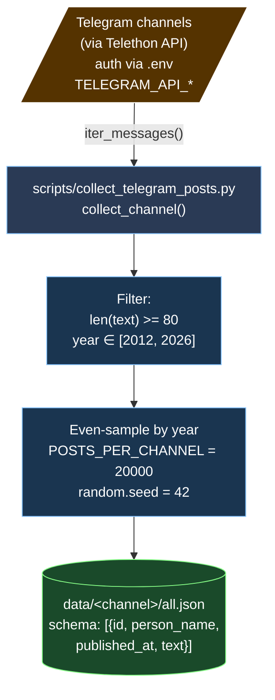

# Flow 1: Telegram Collection

**Дата:** 2026-04-26
**Status:** ✅ implemented (script-only, не в `src/`)
**Index:** [`2026-04-26-architecture-current.md`](2026-04-26-architecture-current.md)

Збір сирих постів з публічних Telegram-каналів через Telethon → JSON-дамп.

**Тригер:** ручний (одноразово per канал; повторно при додаванні нових каналів).

---

## Артефакти

- `data/arestovich/all.json` — 5572 posts (latest full run)
- `data/zdanov/1.json` — 1 post (legacy stub)
- `data/sample_posts.json` — **окрема** multi-person вибірка (350 Арестович + 350 Гордон + 349 Подоляк = 1049 постів). Створена раніше за повний run; **не оновлюється автоматично**, використовується як вхід для evals.

## Майбутнє переселення (Task 21)

Перенести `collect_channel` в `src/sources/telegram.py:TelegramCollector` з єдиним `Source.collect()` інтерфейсом. Output буде писатись через `SourceRepository.save_document()` в Postgres замість JSON-файлу.

---

## Cross-references

- Index: [`2026-04-26-architecture-current.md`](2026-04-26-architecture-current.md)
- Task 21 (sources/ module): [`../plan/2026-04-08-prophet-checker-plan.md`](../plan/2026-04-08-prophet-checker-plan.md)
