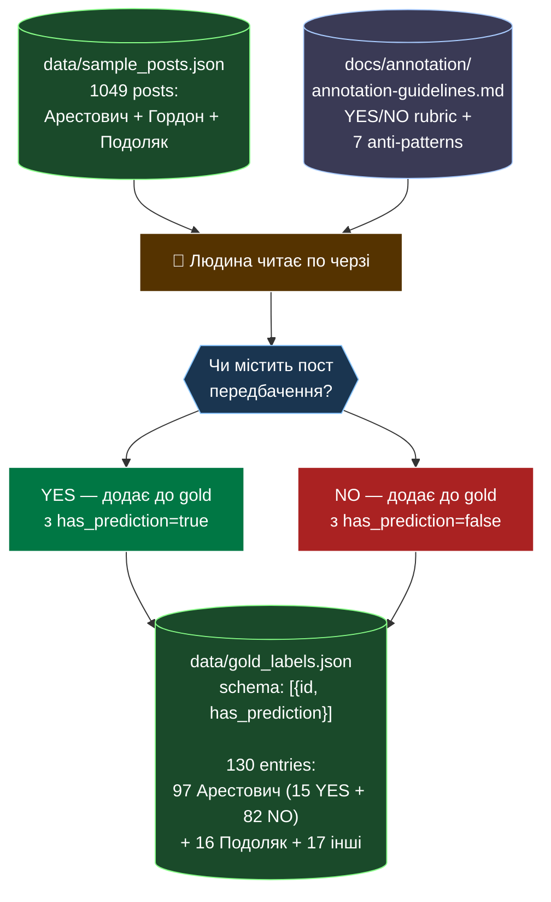

# Flow 2: Gold Annotation

**Дата:** 2026-04-26
**Status:** ✅ implemented (manual + commit-based)
**Index:** [`2026-04-26-architecture-current.md`](2026-04-26-architecture-current.md)

Ручна розмітка постів YES/NO для evals. Це фундамент Flow 3 і Flow 4 (без gold-міток evaluator не може порахувати precision/recall).

**Тригер:** ручний (1-2 рази; розширюється коли треба покрити нові edge cases).

---

## Implementation note

**Жодного скрипта-помічника** в репозиторії немає — `gold_labels.json` створювався вручну (terminal interaction в окремих сесіях, фіксувався як commit).

Послідовність:
- Task 12 початково на 50 постах (commit `428aea4`)
- Розширення до 130 (commit `a992e0f`)

## Споживачі цих даних

- **Flow 3** (Detection eval): порівнює модель's YES/NO з gold для P/R/F1
- **Flow 4** (Extraction quality eval): використовує `has_prediction=true` як trigger to validate що модель щось витягнула

---

## Cross-references

- Annotation rubric: [`../annotation/annotation-guidelines.md`](../annotation/annotation-guidelines.md)
- Споживачі: [`2026-04-26-flow-3-detection-eval.md`](2026-04-26-flow-3-detection-eval.md), [`2026-04-26-flow-4-extraction-quality-eval.md`](2026-04-26-flow-4-extraction-quality-eval.md)
- Index: [`2026-04-26-architecture-current.md`](2026-04-26-architecture-current.md)
