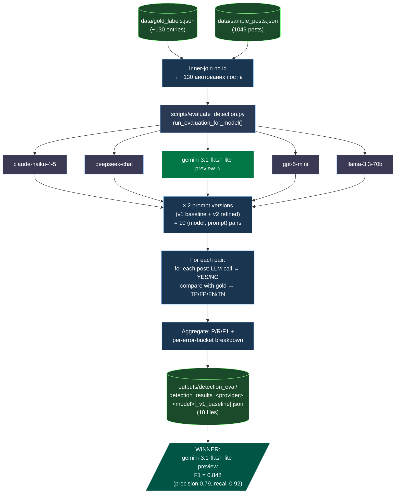

# Flow 3: Detection Eval (Task 13)

**Дата:** 2026-04-26
**Status:** ✅ implemented (Task 13 done, winner picked)
**Index:** [`2026-04-26-architecture-current.md`](2026-04-26-architecture-current.md)

Бенчмарк YES/NO детекції на gold-розмічених постах. 5 моделей × 2 промптові версії → P/R/F1 матриця → вибір production-моделі.

**Тригер:** ручний (запускається при появі нового кандидата на production-модель).

---



## Output schema

```json
{
  "model_id": "...",
  "prompt_version": "v1|v2",
  "n_pos": 0, "n_neg": 0,
  "tp": 0, "fp": 0, "fn": 0, "tn": 0,
  "precision": 0.0, "recall": 0.0, "f1": 0.0,
  "errors": [{"post_id": "...", "label": "YES|NO", "predicted": "YES|NO", ...}]
}
```

## Передбачення наступного запуску

При додаванні нової моделі (наприклад `gemini-3.1-pro`, `claude-opus-4-6`) — кожен запуск перетирає `detection_results_<model>.json` своєю версією. `*_v1_baseline.json` залишається як reference точка.

---

## Cross-references

- Inputs: [`2026-04-26-flow-2-gold-annotation.md`](2026-04-26-flow-2-gold-annotation.md), [`2026-04-26-flow-1-telegram-collection.md`](2026-04-26-flow-1-telegram-collection.md)
- Майбутнє виносу `Detector` в production: [`2026-04-26-flow-production-ingestion.md`](2026-04-26-flow-production-ingestion.md)
- Index: [`2026-04-26-architecture-current.md`](2026-04-26-architecture-current.md)
