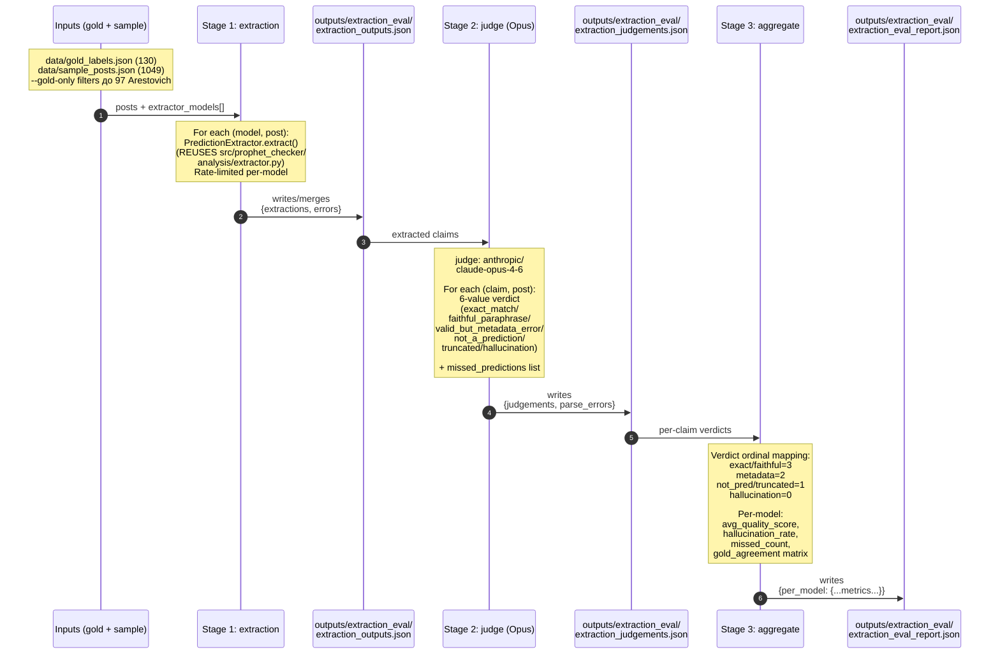

# Flow 4: Extraction Quality Eval (Task 13.5)

**Дата:** 2026-04-26
**Status:** ✅ implemented (Task 13.5, 4 моделі × Opus judge на 97 постах)
**Index:** [`2026-04-26-architecture-current.md`](2026-04-26-architecture-current.md)

3-стадійний LLM-as-judge eval. Stage 1 — extract claims, Stage 2 — Opus судить кожен claim 6-value verdict, Stage 3 — aggregate metrics + gold_agreement matrix.

**Тригер:** ручний (запускається при зміні prompt'у чи додаванні моделі-кандидата).

---



## Стадія 1 schema

```json
{
  "metadata": {"timestamp", "dataset_size", "extractors[]", "author"},
  "extractions": {"<model_id>": {"<post_id>": [claim_dict, ...]}},
  "errors": {"<model_id>": {"<post_id>": "<error_str>"}}
}
```

## Стадія 2 schema

```json
{
  "metadata": {"timestamp", "judge", "source_extractions"},
  "judgements": {"<model_id>": {"<post_id>": {
    "per_claim": [{"claim_text", "verdict", "reasoning"}],
    "missed_predictions": [{"text_excerpt", "why_valid"}],
    "parse_error": null
  }}}
}
```

## Стадія 3 schema (звіт)

```json
{
  "per_model": {"<model_id>": {
    "total_claims": 0,
    "verdict_distribution": {...},
    "avg_quality_score": 0.0,
    "hallucination_rate": 0.0,
    "missed_predictions_count": 0,
    "gold_agreement": {
      "gold_YES_with_valid_extraction": 0,
      "gold_YES_no_valid_extraction": 0,
      "gold_NO_with_extractions_labeled_valid": 0,
      "gold_NO_without_valid_extractions": 0
    }
  }}
}
```

## Latest run (2026-04-26)

| Модель | avg_score | precision | recall |
|--------|----------:|----------:|-------:|
| **gemini-3.1-pro-preview** ⭐ за score | 2.30 | 65 % | 60 % |
| gemini-3.1-flash-lite-preview ⭐ за recall | 2.03 | 51 % | 73 % |
| deepseek-chat | 1.88 | 44 % | 60 % |
| claude-sonnet-4-6 | 1.67 | 33 % | 7 % (катастрофа) |

**Production decision (поки що):** `gemini/gemini-3.1-flash-lite-preview` — кращий recall + 33× дешевше за Pro Preview ([cost comparison](../extraction-quality-eval/2026-04-26-gemini-pro-vs-lite-cost.md)).

## Артефакти позаплановані

- `outputs/extraction_eval/gemini_missed_predictions.json` — manual analysis dump для глибшого аналізу пропущених Gemini-моделями claims (one-off).

---

## Cross-references

- Eval design + plan: [`../extraction-quality-eval/`](../extraction-quality-eval/)
- Cost comparison: [`../extraction-quality-eval/2026-04-26-gemini-pro-vs-lite-cost.md`](../extraction-quality-eval/2026-04-26-gemini-pro-vs-lite-cost.md)
- Per-post report: [`../extraction-quality-eval/2026-04-26-extraction-consolidated-report.md`](../extraction-quality-eval/2026-04-26-extraction-consolidated-report.md)
- Inputs: [`2026-04-26-flow-1-telegram-collection.md`](2026-04-26-flow-1-telegram-collection.md), [`2026-04-26-flow-2-gold-annotation.md`](2026-04-26-flow-2-gold-annotation.md)
- Index: [`2026-04-26-architecture-current.md`](2026-04-26-architecture-current.md)
