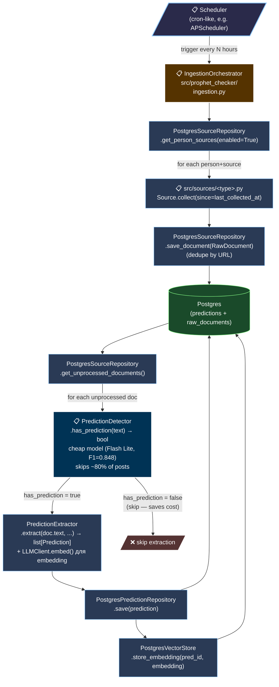

# Flow: Production Ingestion (planned)

**Дата:** 2026-04-26
**Status:** 📋 designed only — Task 15 implements
**Index:** [`2026-04-26-architecture-current.md`](2026-04-26-architecture-current.md)

Цільовий потік даних: scheduler → collect → save → detect → extract → save prediction. Це частина Flow 5b з оригіналу; verification subflow винесена в [`verifier-v2/`](../verifier-v2/), RAG subflow в [`2026-04-26-flow-production-rag.md`](2026-04-26-flow-production-rag.md).

---

## Required gap-fillers

- 📋 **Task 15** — `src/prophet_checker/ingestion.py:IngestionOrchestrator`
- 📋 **Task 16** — FastAPI app entry (`__main__.py`) — exposes orchestrator endpoint
- 📋 **Task 21** — `src/prophet_checker/sources/telegram.py` — переселення з `scripts/`
- 📋 **Scheduler** — поки без task номера; APScheduler або systemd timer
- 📋 **`src/prophet_checker/analysis/detector.py`** — productionize Task 13 winner

## OPEN QUESTION 1: Detection prefilter — обов'язковий?

**Без detector:** PredictionExtractor повертає `[]` для постів без передбачень — implicit detection. Витрачає ~17 % wasted calls на Flash Lite (cheap).

**З detector:** Для Pro Preview / two-tier strategy економить ~85 % коштів ([cost analysis](../extraction-quality-eval/2026-04-26-gemini-pro-vs-lite-cost.md), Option C).

**Decision pending:**
- Якщо лишаємось на Flash Lite single-model → detector опціональний (24% saving)
- Якщо two-tier (Flash detect → Pro extract) → detector **обов'язковий**

## OPEN QUESTION 2: яка модель для detection?

Task 13 winner = Flash Lite (F1 = 0.848). Кандидат: чи може **та сама** модель бути одночасно detector AND extractor? Один LLM call повертає `[]` коли YES/NO=NO — це натуральна детекція без окремого call.

Trade-off:
- Single call → simple, але кожен пост платить full extraction-prompt cost
- Two calls (detect cheap → extract на YES only) → складніше, але дешевше при дорогому extractor

---

## Cross-references

- Verification subflow (separate doc): [`../verifier-v2/2026-04-29-verification-cycle.md`](../verifier-v2/2026-04-29-verification-cycle.md)
- RAG subflow: [`2026-04-26-flow-production-rag.md`](2026-04-26-flow-production-rag.md)
- Idle components inventory: [`2026-04-26-idle-components.md`](2026-04-26-idle-components.md)
- Detection eval (Task 13): [`2026-04-26-flow-3-detection-eval.md`](2026-04-26-flow-3-detection-eval.md)
- Master plan task list: [`../plan/2026-04-08-prophet-checker-plan.md`](../plan/2026-04-08-prophet-checker-plan.md)
- Index: [`2026-04-26-architecture-current.md`](2026-04-26-architecture-current.md)
