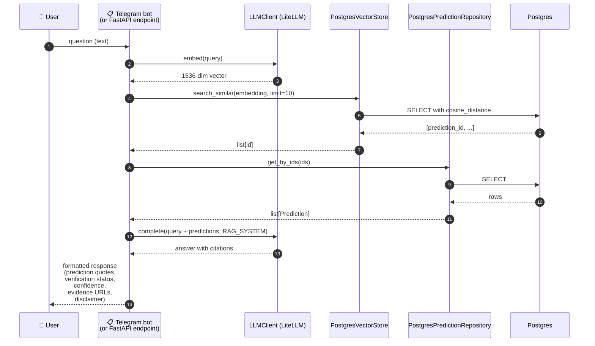

# Flow: Production RAG Query (planned)

**Дата:** 2026-04-26
**Status:** 📋 designed only — Tasks 16 + bot module
**Index:** [`2026-04-26-architecture-current.md`](2026-04-26-architecture-current.md)

Synchronous on-demand flow: користувач питає через Telegram bot або HTTP API → запит ембедиться → pgvector шукає схожі predictions → LLM формує відповідь з cited evidence.

**Тригер:** user-driven (synchronous, request/response).

---

## Required gap-fillers

- 📋 **`src/prophet_checker/bot/handlers.py`** (або FastAPI endpoint) — Tasks: bot module пізніше, FastAPI у Task 16
- 📋 **`PredictionRepository.get_by_ids()`** — наразі є тільки `get_by_person()` і `get_unverified()`. Треба додати batch-getter за списком id (тривіальна додача — `WHERE id IN (...)`)
- ✅ Все інше готове: `LLMClient.embed`, `PostgresVectorStore.search_similar`, `RAG_SYSTEM` prompt — implemented in `src/`

## RAG response format (proposed)

Bot's вихідне повідомлення має містити:
1. Specific predictions з датами та контекстом
2. Verification status (confirmed/refuted/unresolved/premature) + confidence
3. Evidence URLs якщо є
4. Overall accuracy stats якщо relevant
5. **Mandatory disclaimer:** «analysis is automated and may contain inaccuracies»

(Це випливає з `RAG_SYSTEM` prompt у `src/prophet_checker/llm/prompts.py`.)

## Open questions

- **Caching:** RAG queries часто повторюються (популярні питання). Чи кешувати embeddings для query? Чи кешувати full LLM response?
- **Query refinement:** як розпізнавати vague queries («що сказав Арестович?») і просити користувача уточнити перш ніж дорого ходити в RAG?
- **Multi-turn:** чи зберігати conversation history для follow-up questions?

Усі питання — поза scope MVP, deferred до Bot module phase.

---

## Cross-references

- Ingestion subflow (де зʼявляються predictions): [`2026-04-26-flow-production-ingestion.md`](2026-04-26-flow-production-ingestion.md)
- Verification subflow (де predictions отримують status): [`../verifier-v2/2026-04-29-verification-cycle.md`](../verifier-v2/2026-04-29-verification-cycle.md)
- Idle components: [`2026-04-26-idle-components.md`](2026-04-26-idle-components.md)
- Index: [`2026-04-26-architecture-current.md`](2026-04-26-architecture-current.md)
