# Idle Production Components

**Дата:** 2026-04-26
**Status:** 🚧 components built, NOT orchestrated end-to-end
**Index:** [`2026-04-26-architecture-current.md`](2026-04-26-architecture-current.md)

Інвентар написаних класів у `src/`. Між ними немає runtime-зв'язків — нікого, хто би їх викликав end-to-end. Стане «живим» після Task 15 (`IngestionOrchestrator`).

---

```mermaid
classDiagram
    class LLMClient {
        +complete(prompt, system) str
        +embed(text) list~float~
        provider-agnostic via LiteLLM
        embedding: 1536-dim text-embedding-3
    }

    class PredictionExtractor {
        +extract(text, person_id, document_id, person_name, published_date) list~Prediction~
        uses: LLMClient + EXTRACTION_SYSTEM
        ALSO USED BY: extraction_quality_eval Stage 1
    }

    class PredictionVerifier {
        +verify(prediction) Prediction
        uses: LLMClient + VERIFICATION_SYSTEM
        threshold: confidence < 0.6 → UNRESOLVED
        ⚠️ v1 — superseded by verifier-v2 (designed but not implemented)
    }

    class PostgresPersonRepository {
        +save(person) Person
        +get_by_id(id) Person
        +list_all() list~Person~
    }

    class PostgresSourceRepository {
        +save_person_source(ps) PersonSource
        +get_person_sources(person_id) list~PersonSource~
        +save_document(doc) RawDocument
        +get_document_by_url(url) RawDocument
        +get_unprocessed_documents() list~RawDocument~
        +get_last_collected_at(person_id, source_type) datetime
    }

    class PostgresPredictionRepository {
        +save(prediction) Prediction
        +get_by_person(person_id, status) list~Prediction~
        +get_unverified() list~Prediction~
        +update(prediction) Prediction
    }

    class PostgresVectorStore {
        +store_embedding(prediction_id, embedding) None
        +search_similar(embedding, limit) list~str~
    }

    PredictionExtractor --> LLMClient : uses
    PredictionVerifier --> LLMClient : uses
```

## Domain models (`src/prophet_checker/models/domain.py`)

| Model | Fields |
|-------|--------|
| `Person` | id, name, description, created_at |
| `PersonSource` | id, person_id, source_type, source_identifier, enabled |
| `RawDocument` | id, person_id, source_type, url, published_at, raw_text, language, collected_at |
| `Prediction` | id, person_id, document_id, claim_text, prediction_date, target_date, topic, status, confidence, evidence_url, evidence_text, verified_at, embedding |

**Enums:**
- `SourceType` — TELEGRAM, NEWS, ...
- `PredictionStatus` — CONFIRMED, REFUTED, UNRESOLVED

## Не персистована поведінка

- Idempotency: deduplication by URL — поки що в коді є тільки `get_document_by_url()`; реальна логіка skip-if-exists очікує Task 15.
- Vector embedding store — `Prediction.embedding` field ↔ `pgvector.Vector(1536)` колонка. Працює як persistence-layer; нікого хто би це query'ив поки що нема.

---

## Cross-references

- Як ці компоненти оркеструються (заплановано): [`2026-04-26-flow-production-ingestion.md`](2026-04-26-flow-production-ingestion.md), [`2026-04-26-flow-production-rag.md`](2026-04-26-flow-production-rag.md)
- Verifier v2 (replaces v1 PredictionVerifier): [`../verifier-v2/`](../verifier-v2/)
- Index: [`2026-04-26-architecture-current.md`](2026-04-26-architecture-current.md)
