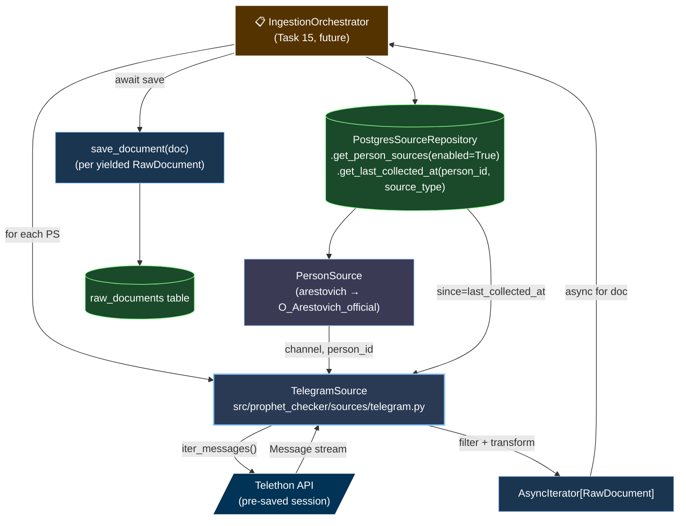

# Task 21: Telegram Source Adapter — Design

**Дата:** 2026-04-29
**Статус:** APPROVED — ready for implementation plan
**Track:** [ingestion-to-aws](.) (Task 21 of 8)
**Supersedes:** [`scripts/collect_telegram_posts.py`](../../scripts/collect_telegram_posts.py) (буде видалено по завершенню)

---

## Problem statement

Поточний Telegram-збір живе в **скрипті** `scripts/collect_telegram_posts.py`:
- Output → JSON-file (`data/<channel>/all.json`)
- Hardcoded channels у Python dict
- Interactive auth flow (phone + SMS code)
- Even-sampling by year — operational concern мішається з domain logic

Це блокує AWS-деплой:
- На EC2 нема interactive стдина для phone-code
- Output має йти в Postgres, не в файл
- Конфігурація channels має приходити з БД (`PersonSource` records)
- Sampling — не потрібний у production (хочемо real-time нові пости)

Task 21 — рефактор у `src/prophet_checker/sources/telegram.py` з **`Source` Protocol** для майбутнього `NewsCollector`.

---

## Architectural decision

**Pattern:** Strategy + Async Iterator. `Source` Protocol описує контракт; `TelegramSource` — concrete impl. **Persistence НЕ в Source** — `Source.collect()` лише yield-ить `RawDocument` об'єкти; orchestrator (Task 15) робить `await source_repo.save_document(doc)`.

**Чому Protocol замість concrete-only:**
- `Source` потрібен для future `NewsCollector` (Task 22, deferred)
- Маленький cost зараз (10 рядків Protocol-у), уникає refactor пізніше

**Чому AsyncIterator замість batch list:**
- Memory: 5572 пости одночасно у RAM не потрібні
- Cooperative cancellation: orchestrator може зупинитись на rate-limit
- Test pattern: async generator easy to mock

**Чому persistence ззовні (orchestrator):**
- Source = collection logic
- SourceRepository = persistence
- Тестується кожна частина окремо
- Source can be reused для one-off CLI bulk-збору без DB

**Empirical justification:** скрипт вже працював end-to-end (5572 Arestovich posts), тому design — суто refactor існуючої логіки в правильні модулі.

---

## Architecture overview



---

## Source Protocol

`src/prophet_checker/sources/base.py`:

```python
from datetime import datetime
from typing import AsyncIterator, Protocol

from prophet_checker.models.domain import PersonSource, RawDocument


class Source(Protocol):
    """Pluggable adapter for raw-document collection.

    Implementations yield RawDocument objects. They do NOT persist —
    orchestrator decides what to do with each yielded doc (save to DB,
    write to file, dedupe, etc.).
    """

    async def collect(
        self,
        person_source: PersonSource,
        since: datetime | None = None,
    ) -> AsyncIterator[RawDocument]:
        """Yield RawDocuments collected from external system.

        Args:
            person_source: configuration (channel name, person_id, source_type)
            since: optional lower bound — yield only docs newer than this datetime.
                   None = collect from beginning (initial backfill).

        Yields:
            RawDocument: one per accepted item. Filter rules (length, type)
                         applied internally per source.
        """
        ...
```

---

## TelegramSource implementation

`src/prophet_checker/sources/telegram.py`:

```python
from datetime import datetime, UTC
from typing import AsyncIterator
from uuid import uuid4

from telethon import TelegramClient
from telethon.errors import (
    ChannelInvalidError, ChannelPrivateError,
    UsernameInvalidError, UsernameNotOccupiedError,
)

from prophet_checker.models.domain import (
    PersonSource, RawDocument, SourceType,
)


class TelegramSource:
    """Source adapter that reads public Telegram channels via Telethon.

    Auth: requires pre-authenticated TelegramClient (session file already
    exists). Does NOT do interactive auth — caller is responsible for
    passing a started client.
    """

    DEFAULT_MIN_TEXT_LENGTH = 80

    def __init__(
        self,
        client: TelegramClient,
        min_text_length: int = DEFAULT_MIN_TEXT_LENGTH,
    ) -> None:
        self._client = client
        self._min_text_length = min_text_length

    async def collect(
        self,
        person_source: PersonSource,
        since: datetime | None = None,
    ) -> AsyncIterator[RawDocument]:
        if person_source.source_type != SourceType.TELEGRAM:
            return  # not our source — empty iterator

        channel = person_source.source_identifier

        try:
            entity = await self._client.get_entity(channel)
        except (
            ChannelInvalidError, ChannelPrivateError,
            UsernameInvalidError, UsernameNotOccupiedError, ValueError,
        ) as e:
            logger.warning("Cannot access @%s: %s", channel, e)
            return

        async for msg in self._client.iter_messages(entity):
            # Stop when reaching messages older than `since`
            if since and msg.date < since:
                break

            # Filter: skip empty / too-short / media-only posts
            if not msg.text or len(msg.text.strip()) < self._min_text_length:
                continue

            yield RawDocument(
                id=str(uuid4()),
                person_id=person_source.person_id,
                source_type=SourceType.TELEGRAM,
                url=f"https://t.me/{channel}/{msg.id}",
                published_at=msg.date,
                raw_text=msg.text.strip(),
                language="uk",  # default; detection deferred
                # collected_at populated by Pydantic model_post_init
            )
```

---

## Storage interaction (NOT in Source)

Source НЕ викликає `SourceRepository.save_document()`. Це **orchestrator's job**.

Pseudo-code orchestrator (для контексту, реалізується в Task 15):

```python
async def ingest_person_source(ps: PersonSource):
    last_at = await source_repo.get_last_collected_at(
        ps.person_id, ps.source_type,
    )
    async for doc in telegram_source.collect(ps, since=last_at):
        try:
            await source_repo.save_document(doc)
        except IntegrityError:  # url unique violation = already saved
            continue  # idempotent skip
```

**Idempotency:** через `RawDocumentDB.url unique=True` (already in `models/db.py:55`). Якщо той самий пост collect'иться двічі (наприклад timing вікно) → IntegrityError, orchestrator skip-ає.

---

## Auth + session handling

**Session file:** `tg_session.session` — Telethon-managed SQLite.

**Lifecycle:**
1. **Dev (one-time, interactive):** developer runs CLI/script локально → telethon prompts phone + SMS → saves session to file
2. **Prod deploy:** session file or-bake'ається в Docker image OR mount як volume
3. **Runtime:** `TelegramClient(session_path, api_id, api_hash)` reads session → connects without auth

**TelegramSource НЕ робить auth flow** — `client.start()` викликається ззовні (наприклад в `IngestionOrchestrator.__aenter__()`):

```python
# Ingestion entry point (Task 15)
api_id = settings.TELEGRAM_API_ID
api_hash = settings.TELEGRAM_API_HASH
session_path = settings.TELEGRAM_SESSION_PATH  # injected via config

client = TelegramClient(session_path, api_id, api_hash)
await client.start()  # raises if session file missing/expired

source = TelegramSource(client)
# ... use source ...

await client.disconnect()
```

**Edge cases:**
- Session expired/revoked: `client.start()` raises → orchestrator logs + alerts; needs manual re-auth on dev machine
- API credentials wrong: similar — fail-fast at startup

---

## Configuration & defaults

**Hardcoded в Source (domain):**
- `min_text_length = 80` — filter, але override-able через constructor

**Per-call (passed by caller):**
- `person_source` — channel + person_id
- `since` — incremental cutoff

**Из env / config (поза Source):**
- `TELEGRAM_API_ID`, `TELEGRAM_API_HASH` — для TelegramClient
- `TELEGRAM_SESSION_PATH` — шлях до .session file

**Виноситься з оригінального скрипта:**
- ❌ `POSTS_PER_CHANNEL = 20000` — sampling cap; не потрібен у real-time mode
- ❌ Even-sampling by year — operational, не для прод
- ❌ `random.seed = 42` — пов'язано з sampling, видаляється
- ❌ DATE_FROM/DATE_TO — заміняються на `since` параметр + iter_messages природно йде з нових до старих

---

## Testing strategy

`tests/sources/test_telegram.py`:

| Test | Scenario |
|------|----------|
| `test_collect_yields_filtered_documents` | Mock client returns 3 messages: short text, valid text, media-only. Source yields ONLY 1 (valid). |
| `test_collect_respects_since_param` | Mock returns mix of pre/post `since` dates. Source stops at boundary. |
| `test_collect_skips_non_telegram_source` | PersonSource with `source_type=NEWS` → empty iterator. |
| `test_collect_handles_channel_access_error` | Mock raises `ChannelPrivateError` on `get_entity()` → empty iterator + warning logged. |
| `test_collect_builds_correct_url` | Verified `https://t.me/<channel>/<msg_id>` format. |

**Mock pattern (Telethon):**
```python
from unittest.mock import AsyncMock, MagicMock

def make_mock_client(messages: list[Mock]) -> MagicMock:
    client = MagicMock()
    client.get_entity = AsyncMock(return_value=MagicMock())  # entity OK
    
    async def iter_messages_gen(entity):
        for m in messages:
            yield m
    client.iter_messages = iter_messages_gen
    return client
```

**~5 unit tests, 0 integration** — real Telegram занадто flaky для tests.

---

## Migration path

1. **Implementation:** create `src/prophet_checker/sources/{base.py, telegram.py, __init__.py}` + tests
2. **Cleanup:** delete `scripts/collect_telegram_posts.py` (its role superseded)
3. **`tg_session.session`** залишається на місці — Task 17 (Docker) визначить deployment strategy
4. **`scripts/data/sample_posts.json`** і `data/arestovich/all.json` — historical artifacts, лишаються (потрібні для evals)

---

## Out of scope

❌ **Bootstrap (Person + PersonSource records)** — defer до **Task 18** (Alembic migration з seed data). Без bootstrap source не може collect'ити, але Task 21 unit tests цього не потребують.

❌ **Language detection** — hardcoded `"uk"`, defer.

❌ **NewsCollector** — Task 22, deferred за MVP scope.

❌ **Rate-limiting / retry logic** — orchestrator's concern (Task 15).

❌ **One-off CLI** для bulk-збору — старий script мав це, але YAGNI поки не знадобиться.

---

## Edge cases

| Scenario | Behavior |
|----------|----------|
| Channel doesn't exist | `ChannelInvalidError` / `UsernameNotOccupiedError` → empty iterator + warn-log |
| Channel is private | `ChannelPrivateError` → empty iterator + warn-log |
| Network failure mid-collection | telethon raises → propagates to orchestrator (lets it decide retry strategy) |
| Empty channel (no messages) | iter_messages yields nothing → empty iterator (correct) |
| Channel with only media (no text) | All messages skipped by filter → empty iterator |
| `since` set to NOW | iter_messages goes newest-first → first message is older → break immediately → empty iterator |
| `since` is None | Collect from beginning to current — initial backfill mode |
| Same message yielded twice (rare) | Orchestrator's `save_document()` catches `IntegrityError` on URL unique constraint |

---

## Cross-references

- Index: [`README.md`](README.md) (буде створено при додаванні наступного doc'у в track)
- Architecture context: [`../architecture/2026-04-26-flow-production-ingestion.md`](../architecture/2026-04-26-flow-production-ingestion.md)
- Master plan Task 21: [`../plan/2026-04-08-prophet-checker-plan.md`](../plan/2026-04-08-prophet-checker-plan.md)
- Storage interfaces: `src/prophet_checker/storage/interfaces.py`
- Domain models: `src/prophet_checker/models/domain.py`
