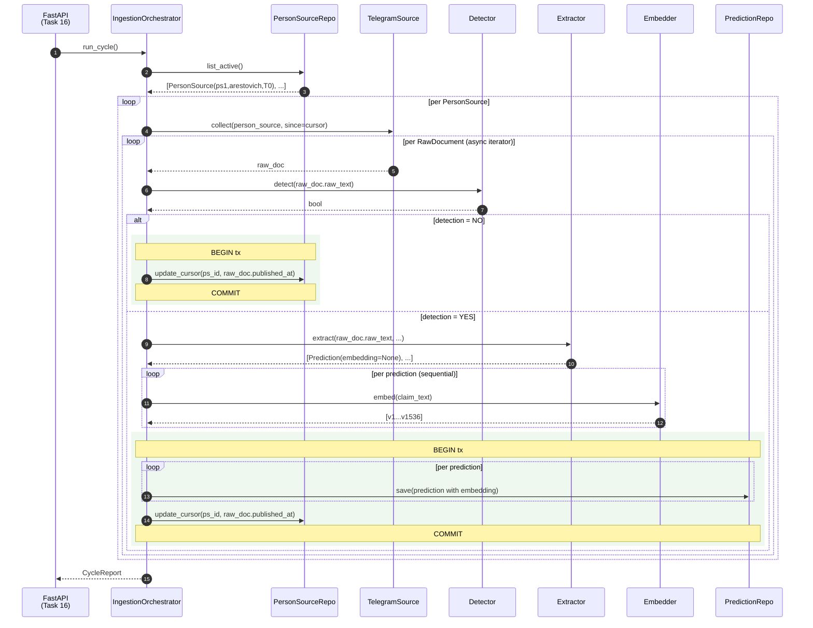
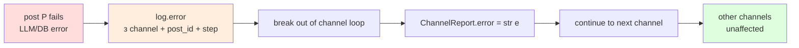

# IngestionOrchestrator — Design Spec

**Status:** approved 2026-05-01
**Task:** 15 (master plan) / first gap-filler у Flow 5b production-ingestion
**Prerequisites:** ✅ Task 21 (TelegramSource), ✅ LLM Client Split (2026-05-01)
**Next:** Task 16 (FastAPI HTTP-trigger), Task 17-19 (Docker/Alembic/integration smoke)

---

## TL;DR

`IngestionOrchestrator.run_cycle()` — async-функція що приймає HTTP-trigger, ітерує всіх активних `PersonSource` рядків, для кожного збирає нові пости з `TelegramSource` починаючи з `last_collected_at` cursor'а, для кожного поста прокручує detection → (якщо YES) extraction → embed → save, оновлює cursor після кожного успішного поста. На помилці зупиняє лише поточний канал; інші продовжують. Returns `CycleReport` із summary stats.

Pipeline: **detection prefilter + single-tier extraction**. Економимо ~70% extraction-call'ів (Task 13: на постах БЕЗ предсказань detection=NO одразу advance cursor, extraction не викликається).

---

## Architectural Decisions (Q1–Q5)

| # | Decision | Rationale |
|---|----------|-----------|
| Q1 | **Detection prefilter + single-tier Flash Lite extraction** | Economy: ~70% постів без передбачень не доходять до extract-call. YAGNI two-tier (Pro Preview filter) — потребує proof-of-concept. |
| Q2 | **HTTP `POST /ingest/run` обробляє ВСІ активні sources за один тригер** | Найпростіший API — один cron-tick = один HTTP-call. Per-channel виклики — premature optimization (async вже паралелить I/O). |
| Q3 | **Cursor-only dedup через `person_sources.last_collected_at`** | Strict cursor + per-post commits = forward-progress. Documents-existence check — YAGNI (Telegram id стабільні per Task 21). |
| Q4 | **Halt-channel on error, continue other channels** | Industry-standard ETL semantics. Forward-progress на здорових каналах, halt на broken для manual investigation. |
| Q5 | **Detection — окремий клас `PredictionDetector`** в `analysis/detector.py` | Симетрично до `PredictionExtractor`; SRP; isolated tests. |

---

## Module Layout

```
src/prophet_checker/
  ingestion/                   ← NEW package
    __init__.py
    orchestrator.py            ← IngestionOrchestrator class

  analysis/
    detector.py                ← NEW: PredictionDetector
    extractor.py               (existing — unchanged)
    verifier.py                (existing — unchanged)

  sources/
    base.py                    (existing)
    telegram.py                (existing)
    mock.py                    ← NEW: MockSource for tests

  llm/                         (existing — split landed 2026-05-01)
    client.py                  LLMClient.complete()
    embedding.py               EmbeddingClient.embed()
    prompts.py                 DETECTION_SYSTEM_V2, EXTRACTION_SYSTEM

  models/
    domain.py                  ← MODIFIED: add last_collected_at to PersonSource
    db.py                      ← MODIFIED: add last_collected_at column

  storage/
    interfaces.py              ← MODIFIED: add list_active + update_cursor methods
    postgres.py                ← MODIFIED: PostgresPersonSourceRepository implementations

alembic/versions/
  <rev>_add_last_collected_at.py  ← NEW migration

tests/
  test_analysis_detector.py    ← NEW (~4 tests)
  test_ingestion_orchestrator.py  ← NEW (~9 tests)
  test_ingestion_integration.py   ← NEW (~2 tests)
```

### Class responsibilities

| Клас | Що робить | Constructor deps |
|------|-----------|------------------|
| `IngestionOrchestrator` | Координує: query active sources → per-channel collect → per-post pipeline → cursor advance | `session`, `source_repo`, `prediction_repo`, `detector`, `extractor`, `embedder`, `sources: dict[SourceType, Source]` |
| `PredictionDetector` | One LLM-call с `DETECTION_SYSTEM_V2`, parse YES/NO → bool | `llm: LLMClient` |
| `PredictionExtractor` | (existing) extract predictions з `embedding=None` | `llm: LLMClient` |
| `EmbeddingClient` | (existing) text → vector | own |
| `TelegramSource` | (existing) yields `RawDocument` since cursor | Telethon |
| `MockSource` | Returns predefined `RawDocument` list для tests | constructor takes the list |

### `IngestionOrchestrator` API

```python
class IngestionOrchestrator:
    def __init__(
        self,
        session: AsyncSession,
        source_repo: PersonSourceRepository,
        prediction_repo: PredictionRepository,
        detector: PredictionDetector,
        extractor: PredictionExtractor,
        embedder: EmbeddingClient,
        sources: dict[SourceType, Source],
    ) -> None: ...

    async def run_cycle(self) -> CycleReport: ...


class CycleReport(BaseModel):
    started_at: datetime
    finished_at: datetime
    channels_processed: list[ChannelReport]


class ChannelReport(BaseModel):
    person_source_id: str
    posts_seen: int
    posts_with_predictions: int
    predictions_extracted: int
    cursor_advanced_to: datetime | None
    error: str | None = None
```

`sources` parameter — `dict[SourceType, Source]` для multi-source dispatch. MVP: тільки `{SourceType.TELEGRAM: TelegramSource}`.

---

## Data Flow



### Semantic invariants

1. **Cursor advances after every fully-processed post** — і YES (з saves) і NO (без saves). Never re-detect a previously-seen post.
2. **Embeds виконуються ПЕРЕД transaction**. Network I/O (200-500ms per call) поза tx-scope — не тримати DB-lock'и.
3. **Per-post atomic transaction**. predictions saves + cursor update — в одній `AsyncSession.begin()` block. Будь-яка помилка → rollback всього + cursor не зрушується.
4. **Re-processing safety**. На halt: cursor залишається на last successful post. Наступний цикл retry'їть з того ж місця. Прогон на свіжому стані (нові uuid4 для predictions) — no duplicates бо в DB ще нема.

### Error path



`run_cycle()` завжди завершується успішно (з точки зору FastAPI) — caller бачить `CycleReport`. Halted channels мають `error` field set.

---

## Data Model + Migration

### Pydantic domain (`src/prophet_checker/models/domain.py`)

```python
class PersonSource(BaseModel):
    id: str
    person_id: str
    source_type: SourceType
    source_identifier: str
    enabled: bool = True
    last_collected_at: datetime | None = None   # NEW

    def model_post_init(self, __context) -> None:
        if self.last_collected_at is None:
            self.last_collected_at = datetime.now(UTC)
```

Default = creation time (через `model_post_init`). Семантика: новий source починає з моменту створення row. Historical backfill — manual SQL.

### SQLAlchemy DB model (`src/prophet_checker/models/db.py`)

```python
last_collected_at: Mapped[datetime] = mapped_column(
    DateTime(timezone=True),
    nullable=False,
    server_default=func.now(),
)
```

`NOT NULL` + `server_default=NOW()` — ніяких NULL-edge cases в коді.

### Alembic migration

```python
def upgrade():
    op.add_column(
        "person_sources",
        sa.Column(
            "last_collected_at",
            sa.DateTime(timezone=True),
            nullable=False,
            server_default=sa.func.now(),
        ),
    )

def downgrade():
    op.drop_column("person_sources", "last_collected_at")
```

Backfill існуючих rows автоматичний через `server_default=NOW()`.

### Storage API additions

```python
# storage/interfaces.py
class PersonSourceRepository(Protocol):
    # existing methods
    async def list_active(self) -> list[PersonSource]: ...
    async def update_cursor(self, person_source_id: str, cursor: datetime) -> None: ...
```

```python
# storage/postgres.py
class PostgresPersonSourceRepository:
    async def list_active(self) -> list[PersonSource]:
        # SELECT * FROM person_sources WHERE enabled = TRUE
        ...

    async def update_cursor(self, person_source_id: str, cursor: datetime) -> None:
        # UPDATE person_sources SET last_collected_at = :cursor WHERE id = :id
        ...
```

### Transaction primitive

Per-post atomic transaction через існуючу `AsyncSession.begin()`:

```python
async with self._session.begin():
    for p in predictions:
        await self._prediction_repo.save(p)
    await self._source_repo.update_cursor(ps.id, raw_doc.published_at)
# auto-commit on exit; auto-rollback on exception
```

`Postgres*Repository` приймають той самий `AsyncSession` що orchestrator — координація через спільну сесію. Нічого нового на DB-рівні.

---

## Error Handling

| Step | Можливі помилки | Поведінка |
|------|------------------|-----------|
| `tg_source.collect()` | `ChannelPrivateError`, `FloodWaitError`, network | Halt channel — TelegramSource піднімає (Task 21); orchestrator catches → log + skip |
| `detector.detect()` | `litellm.APIError`, parsing JSON malformed | Halt channel — LiteLLM retried 3× з backoff |
| `extractor.extract()` | те саме | Halt channel |
| `embedder.embed()` | те саме | Halt channel — embed ПЕРЕД tx, тож commit ще не стався |
| `prediction_repo.save()` | `IntegrityError`, `OperationalError` | Halt channel — tx rollback автоматичний |
| `source_repo.update_cursor()` | те саме | Halt channel — rollback включає saves |

**НЕ ловимо:**
- `KeyboardInterrupt`, `SystemExit` — clean shutdown
- `pydantic.ValidationError` на domain-моделях — bug у нашому коді, fail loud

**Structured logging:**

```python
logger.error(
    "ingestion: channel halted on post",
    extra={
        "person_source_id": ps.id,
        "channel": ps.source_identifier,
        "document_id": raw_doc.id,
        "step": "embed",
        "exception": str(exc),
    },
)
```

`ChannelReport.error` = коротке текстове резюме (`"halted on post tg:arestovich:12345 at step=embed"`). Деталі — в логах.

---

## Testing Strategy

### Layer 1: Detector unit (`tests/test_analysis_detector.py`)

Дзеркалить `test_analysis_extractor.py`. Mock LLM via `AsyncMock`:

| Test | Сценарій |
|------|----------|
| `test_detect_returns_true_on_yes_response` | LLM → "YES" → True |
| `test_detect_returns_false_on_no_response` | LLM → "NO" → False |
| `test_detect_returns_false_on_malformed_response` | LLM → "garbage" → False (graceful) |
| `test_detect_propagates_llm_exception` | LLM throws → re-raise (orchestrator catches) |

**~4 тести.**

### Layer 2: Orchestrator unit (`tests/test_ingestion_orchestrator.py`)

Mocks: `Source`, `Detector`, `Extractor`, `Embedder`, repos. Тестуємо control flow:

| Test | Сценарій |
|------|----------|
| `test_run_cycle_no_active_sources` | repo.list_active() → []; report.channels=[] |
| `test_run_cycle_processes_posts_in_one_channel` | 3 posts, 2 with predictions; assert detect×3, extract×2, embeds count, saves count |
| `test_detection_no_advances_cursor_without_extraction` | detection→False; assert update_cursor called, extract NOT called |
| `test_detection_yes_extracts_embeds_saves_atomically` | check tx usage: saves всередині `begin()` block |
| `test_embed_failure_halts_channel_no_save` | embed throws; assert no save calls; cursor not advanced; report.error set |
| `test_save_failure_rollbacks_and_halts` | save throws on 3rd of 5 predictions; assert rollback (no saves committed); cursor not advanced |
| `test_one_channel_halt_does_not_block_others` | 2 channels; ch1 fails detect on post 2; ch2 processes fully |
| `test_cursor_advances_per_post` | 3 posts → update_cursor called 3 times with each post's published_at |
| `test_cycle_report_aggregates_counts` | report.channels[0].predictions_extracted == sum across posts |

**~9 тестів.**

### Layer 3: Integration smoke (`tests/test_ingestion_integration.py`)

Через **`MockSource`** (`src/prophet_checker/sources/mock.py`):

```python
class MockSource:
    def __init__(self, documents: list[RawDocument]):
        self._documents = documents

    async def collect(
        self,
        person_source: PersonSource,
        since: datetime | None = None,
    ) -> AsyncIterator[RawDocument]:
        cutoff = since or datetime.min.replace(tzinfo=UTC)
        for doc in self._documents:
            if doc.person_id == person_source.person_id and doc.published_at > cutoff:
                yield doc
```

Реалізує `Source` Protocol з `sources/base.py` (Task 21).

Test: real `IngestionOrchestrator` + `MockSource` + mocked LLM (`AsyncMock`) + **in-memory repos** (нові `InMemoryPersonSourceRepository`, `InMemoryPredictionRepository`).

| Test | Сценарій |
|------|----------|
| `test_end_to_end_three_posts_with_mocked_llm` | Happy path: 3 posts → 5 predictions saved + cursor advances |
| `test_halt_recovery_resumes_from_last_cursor` | Cycle 1 fails on post 2; cycle 2 picks up from post 2 |

**~2 тести.**

### Test count delta

- +4 detector
- +9 orchestrator
- +2 integration
- **+15 tests**

Поточних 101 + 15 = **116** після Task 15.

### Чого НЕ тестуємо тут

- ❌ Real Telegram API — manual / Task 19
- ❌ Real OpenAI/Gemini — manual / Task 19
- ❌ Real Postgres + pgvector — Task 19
- ❌ Concurrent `run_cycle()` calls — Task 16 problem (FastAPI `BackgroundTasks` queue)
- ❌ Performance/latency — moot until production traffic

---

## Out of Scope (explicitly deferred)

- ❌ **Two-tier extraction** (Flash Lite → Pro Preview as judge filter) — needs proof-of-concept на ~50 постах. Майбутній рефактор.
- ❌ **FastAPI HTTP endpoint** — Task 16. Цей дизайн tільки `run_cycle()` API.
- ❌ **Bot frontend** — Phase 2 (separate brainstorm).
- ❌ **Verifier orchestration** — Verifier v2 designed, але запускається окремо (cron / scheduled task), не як частина ingestion-cycle.
- ❌ **Re-embed missing** — якщо embed впав → halt channel, не save with `embedding=NULL`. YAGNI поки не побачимо real failure rates.
- ❌ **Per-post failure count + dead-letter** — деплоємо MVP simple halt-on-error; стрімкі retries додамо коли побачимо stuck channels.
- ❌ **NewsCollector** (other source types) — `sources` dict spec'нутий extensible-ним, але implementation NEWS — не в MVP.
- ❌ **Concurrent cycle protection** — Task 16 (FastAPI має queue/lock проти двох одночасних `run_cycle()`).

---

## Cross-references

- **LLM Client Split** (prerequisite, ✅ done): [`2026-05-01-llm-client-split-design.md`](2026-05-01-llm-client-split-design.md)
- **Task 21 TelegramSource** (prerequisite, ✅ done): [`2026-04-29-task-21-telegram-source-plan.md`](2026-04-29-task-21-telegram-source-plan.md)
- **Architecture overview**: [`../architecture/2026-04-26-architecture-current.md`](../architecture/2026-04-26-architecture-current.md)
- **Production ingestion flow** (5b): [`../architecture/2026-04-26-flow-production-ingestion.md`](../architecture/2026-04-26-flow-production-ingestion.md)
- **Master plan**: [`../plan/2026-04-08-prophet-checker-plan.md`](../plan/2026-04-08-prophet-checker-plan.md)
- **Detection eval** (Task 13, validated DETECTION_SYSTEM_V2): [`../architecture/2026-04-26-flow-3-detection-eval.md`](../architecture/2026-04-26-flow-3-detection-eval.md)
