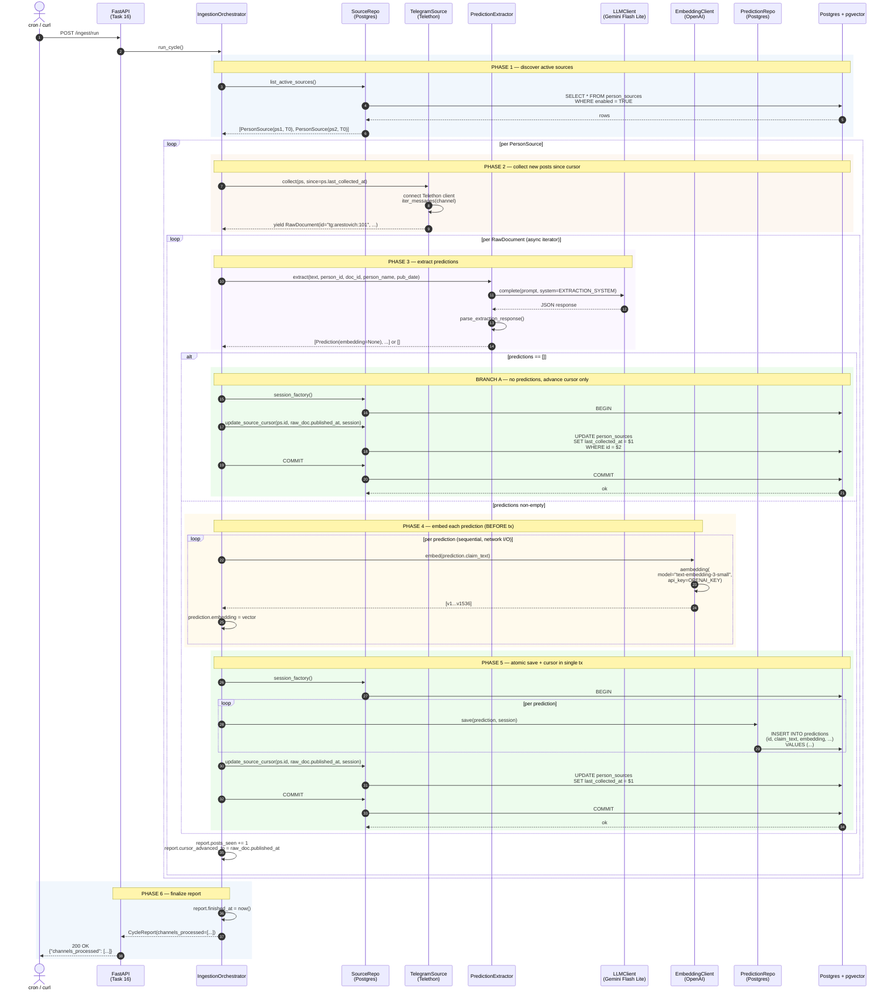
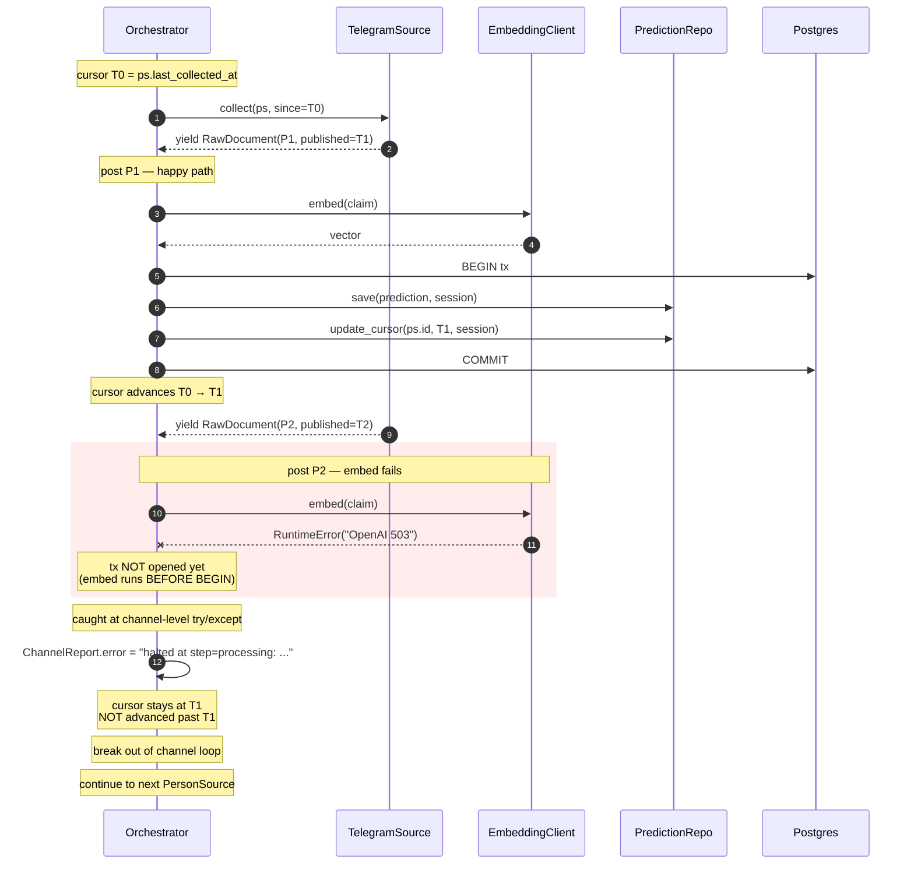
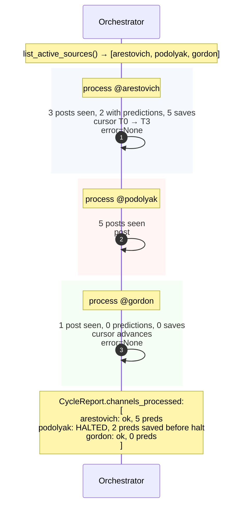

# IngestionOrchestrator — Data Flow Sequence Diagram

**Companion document to:** [`2026-05-01-ingestion-orchestrator-design.md`](2026-05-01-ingestion-orchestrator-design.md)

Detailed sequence diagram covering the full ingestion data flow from HTTP trigger through DB commit, including transaction boundaries, branch points, and error paths.

---

## 1. Full happy-path flow

---

## 2. Error path — halt-channel-on-error

When any step inside per-channel processing throws (LLM 5xx after retries, embedding API down, DB write fails), the channel halts but other channels continue.

**Recovery on next cycle:**
- `cron` triggers `POST /ingest/run` again
- orchestrator queries active sources — same set
- for halted channel, `last_collected_at = T1` (unchanged from previous halt)
- `TelegramSource.collect(ps, since=T1)` yields P2 fresh
- if embed now works → P2 processed normally, cursor advances T1 → T2

No data loss. No duplicates (predictions for P1 already in DB; P2 had nothing committed).

---

## 3. Multi-channel parallel-safe sequencing

Single `run_cycle()` processes channels sequentially. Halt in one channel does not affect others.

---

## 4. Transaction boundaries — what's atomic

| Operation | Inside tx? | Why |
|-----------|-----------|-----|
| `list_active_sources()` | Own tx (read) | Auto-commits on session close; not part of post processing |
| `tg_source.collect()` | No | External API call; can't roll back Telegram |
| `extractor.extract()` | No | External API call (LLM) |
| `embedder.embed()` per prediction | **No — explicitly outside** | Network I/O 200-500ms; tying tx open this long would lock rows. All embeds run sequentially BEFORE BEGIN. |
| `prediction_repo.save()` per prediction | **YES — same tx** | Atomic with cursor advance |
| `source_repo.update_source_cursor()` | **YES — same tx** | If save fails, cursor must NOT advance |

**Atomicity rule:** "predictions for post P are saved iff cursor advances past P." Either both happen or neither.

---

## 5. Cursor lifecycle for one PersonSource

```mermaid
stateDiagram-v2
    [*] --> CursorAtT0: PersonSource created<br/>last_collected_at = creation_time
    CursorAtT0 --> ProcessingP1: collect yields P1 (published T1 > T0)
    ProcessingP1 --> CursorAtT1: extract+embed+save<br/>OK; tx commits
    ProcessingP1 --> CursorAtT0: any step fails<br/>tx rollback OR no tx opened
    CursorAtT1 --> ProcessingP2: next iteration
    ProcessingP2 --> CursorAtT2: OK
    ProcessingP2 --> CursorAtT1: fails
    CursorAtT2 --> [*]: cycle ends<br/>(other channels processed too)

    note right of CursorAtT0
        On halt at P1, cursor unchanged
        Next cycle resumes at P1
    end note

    note right of CursorAtT1
        Detection=NO advances cursor too
        (so we don't re-detect non-prediction post)
    end note
```

---

## 6. What this diagram does NOT show

- **Concurrent `run_cycle()` invocations** — Task 16 (FastAPI) responsibility (queue/lock against double-trigger)
- **Real-time monitoring** — separate observability concern
- **Verifier flow** — runs separately (cron job), not part of ingestion cycle
- **RAG/Bot flow** — read-side, not in scope here
- **Alembic migration timing** — runs once at deploy (Task 17), not per-cycle

---

## Cross-references

- **Spec:** [`2026-05-01-ingestion-orchestrator-design.md`](2026-05-01-ingestion-orchestrator-design.md)
- **Implementation plan:** [`2026-05-01-ingestion-orchestrator-plan.md`](2026-05-01-ingestion-orchestrator-plan.md)
- **Source Protocol (Task 21):** `src/prophet_checker/sources/base.py`
