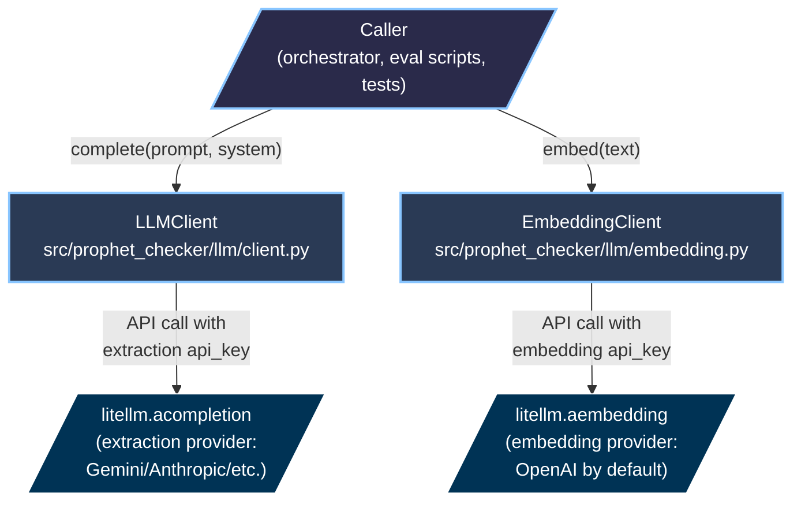

# LLM Client Split (EmbeddingClient extraction) — Design

**Дата:** 2026-05-01
**Статус:** APPROVED — ready for implementation plan
**Track:** [ingestion-to-aws](.) (prerequisite for Task 15)
**Supersedes:** Single-LLMClient pattern in [`src/prophet_checker/llm/client.py`](../../src/prophet_checker/llm/client.py)

---

## Problem statement

Поточний `LLMClient` змішує дві відповідальності:

```python
class LLMClient:
    def __init__(self, provider, model, api_key, embedding_model=..., ...):
        self._model = ...                         # extraction model (Gemini, Anthropic, etc.)
        self._embedding_model = embedding_model   # OpenAI text-embedding-3-small
        self._api_key = api_key

    async def complete(self, prompt, system) -> str:        # uses self._api_key
    async def embed(self, text) -> list[float]:             # ALSO uses self._api_key ← BUG
```

`embed()` викликає `litellm.aembedding(api_key=self._api_key)`. Якщо `provider="gemini"`, то `self._api_key` — Gemini API key, який **не дійсний** для OpenAI embedding endpoint. Production deploy зломає silently.

Зараз "працює" тільки тому, що `.env` має обидва ключі і LiteLLM fallback'ається на `OPENAI_API_KEY` env var. Це fragile.

**Виявлено** під час brainstorm Task 15 (IngestionOrchestrator) — orchestrator потребує надійні embeddings для production. Тому split — **prerequisite** для Task 15.

---

## Architectural decision

**Pattern:** Strict split with Single Responsibility per class. Кожен клас у своєму файлі.

```
src/prophet_checker/llm/
├── client.py        # LLMClient — completion only
├── embedding.py     # EmbeddingClient — embed only (NEW)
└── prompts.py       # unchanged
```

**Чому split, а не один клас з двома keys:**
- Кожен клас має одну причину для зміни (Single Responsibility Principle)
- Тестування простіше — два дрібних testy замість одного складного
- Майбутні embedding-провайдери (Cohere, Voyage AI, локальні моделі) — чистий swap без зачіпання LLMClient
- Eval-flows (Task 13.5) використовують лише completion — не змішують з embeddings

**Ціна:** компоненти що раніше брали один `llm` тепер беруть два (`llm`, `embedder`). Mitigated через **X3 decision** (див. нижче) — embed винесений з `PredictionExtractor`, тому розповсюдження мінімальне.

**Чому окремі файли (F2):**
- File-level Single Responsibility
- Якщо додамо `BatchEmbeddingClient`, `LocalEmbeddingClient` etc. — додаємо файли без structural refactor
- Маленькі файли (~20 рядків) — легко reason about

**Чому extractor НЕ embed'ить (X3):**
- Pure adapter: extractor → витягує claims, embedder → embed'ить, orchestrator → організує
- Transparency у Task 15 orchestrator code (явний embed step)
- DetectionLLM hack-wrapper зникає (зараз 25 рядків hack у `scripts/evaluate_detection.py`)
- Detection eval працює без embed integration — не потрібен ні real key ні stub

---

## Architecture overview



**Кожен client використовує власний `api_key`** — прокидається через constructor, передається в `litellm.acompletion` / `litellm.aembedding` явно. Жодних shared credentials.

---

## `LLMClient` (modified, simpler)

`src/prophet_checker/llm/client.py`:

```python
from __future__ import annotations

from litellm import acompletion


class LLMClient:
    def __init__(
        self,
        provider: str,
        model: str,
        api_key: str,
        temperature: float = 0.1,
        num_retries: int = 3,
    ):
        self._model = f"{provider}/{model}" if provider != "openai" else model
        self._api_key = api_key
        self._temperature = temperature
        self._num_retries = num_retries

    async def complete(self, prompt: str, system: str | None = None) -> str:
        messages = []
        if system:
            messages.append({"role": "system", "content": system})
        messages.append({"role": "user", "content": prompt})

        response = await acompletion(
            model=self._model,
            messages=messages,
            temperature=self._temperature,
            api_key=self._api_key,
            num_retries=self._num_retries,
        )
        return response.choices[0].message.content
```

**Видаляється:**
- `embedding_model` параметр у `__init__`
- `self._embedding_model` field
- `embed()` метод
- `from litellm import aembedding` import

**Behavioral change:** none — `complete()` сигнатура та поведінка не змінюється.

---

## `EmbeddingClient` (new)

`src/prophet_checker/llm/embedding.py`:

```python
from __future__ import annotations

from litellm import aembedding


class EmbeddingClient:
    def __init__(
        self,
        model: str = "text-embedding-3-small",
        api_key: str | None = None,
        num_retries: int = 3,
    ):
        self._model = model
        self._api_key = api_key
        self._num_retries = num_retries

    async def embed(self, text: str) -> list[float]:
        response = await aembedding(
            model=self._model,
            input=[text],
            api_key=self._api_key,
            num_retries=self._num_retries,
        )
        return response.data[0].embedding
```

**Параметричність:** `model` за замовчуванням `text-embedding-3-small` (OpenAI), `api_key` опціональний (None → LiteLLM ENV fallback на `OPENAI_API_KEY`). Готово для swap'ів на Cohere/Voyage без structural змін.

**Output:** 1536-dim list[float] (для default model). Розмірність залежить від `model` — caller відповідає за consistency з pgvector schema (`Vector(1536)`).

---

## `PredictionExtractor` (modified, drops embed call)

`src/prophet_checker/analysis/extractor.py`:

```python
class PredictionExtractor:
    def __init__(self, llm: LLMClient) -> None:        # ← single dependency
        self._llm = llm

    async def extract(self, text, person_id, document_id, person_name, published_date):
        # Same prompt-building + LLM call + parsing as before
        try:
            prompt = build_extraction_prompt(...)
            response = await self._llm.complete(prompt, system=get_extraction_system())
        except Exception:
            logger.exception("LLM call failed during extraction")
            return []

        raw_predictions = parse_extraction_response(response)
        if not raw_predictions:
            return []

        predictions: list[Prediction] = []
        for raw in raw_predictions:
            # ... extract claim_text, prediction_date, target_date, topic ...

            predictions.append(
                Prediction(
                    id=str(uuid4()),
                    person_id=person_id,
                    document_id=document_id,
                    claim_text=claim,
                    prediction_date=prediction_date,
                    target_date=target_date,
                    topic=raw.get("topic", ""),
                    status=PredictionStatus.UNRESOLVED,
                    confidence=0.0,
                    evidence_url=None,
                    evidence_text=None,
                    embedding=None,                  # ← orchestrator populates separately
                )
            )

        return predictions
```

**Видаляється:**
- `embedding = await self._llm.embed(claim)` call
- `try/except` навколо embed
- `# Generate embedding for semantic search` comment

**Semantic change:** extractor повертає predictions з `embedding=None`. Orchestrator (Task 15) робить embed окремо:

```python
# Pseudo-code Task 15 orchestrator (future):
predictions = await extractor.extract(text, ...)
for pred in predictions:
    pred.embedding = await embedder.embed(pred.claim_text)
    await prediction_repo.save(pred)
```

---

## `DetectionLLM` wrapper — REMOVED

`scripts/evaluate_detection.py` (~25 рядків видаляється):

```python
# DELETED:
# class DetectionLLM:
#     """Wrapper around LLMClient that stubs embed() to return [0.0]*1536
#     without calling the inner provider's embed endpoint.
#
#     Rationale: Gemini/DeepSeek/Groq don't have OpenAI-compatible embedding
#     endpoints, and detection eval only needs count > 0 — embeddings are
#     dead weight."""
#     def __init__(self, inner: LLMClient): ...
#     async def complete(...): return await self._inner.complete(...)
#     async def embed(...): return [0.0] * 1536  # stub
```

Тепер не потрібно — `PredictionExtractor` не викликає embed взагалі. Detection eval отримує `Prediction` об'єкти з `embedding=None`, тільки `claim_text` і metadata перевіряються — embedding ігнорується (як і має бути).

`_default_extractor_factory` спрощується:

```python
def _default_extractor_factory(model_id: str) -> PredictionExtractor:
    if "/" not in model_id:
        raise ValueError(f"model_id must be 'provider/model', got {model_id!r}")
    provider, model = model_id.split("/", 1)
    if provider not in PROVIDER_API_KEY_ENV:
        raise ValueError(f"Unknown provider: {provider!r}")
    api_key = os.environ.get(PROVIDER_API_KEY_ENV[provider])
    if not api_key:
        raise RuntimeError(f"Missing API key: {PROVIDER_API_KEY_ENV[provider]}")
    client = LLMClient(provider=provider, model=model, api_key=api_key, temperature=0.0)
    return PredictionExtractor(client)  # ← single dependency
```

---

## Test changes

| File | Change |
|------|--------|
| `tests/test_llm_client.py` | **Modify:** видалити `test_llm_client_embed` test (перенесено в новий файл) |
| `tests/test_llm_embedding.py` | **Create:** ~3 tests для `EmbeddingClient` (mock `litellm.aembedding`, parametric model, default api_key=None) |
| `tests/test_analysis_extractor.py` | **Modify:** `make_llm()` без embed mock; assertions `assert p.embedding is None` замість `len(p.embedding) == 1536` |
| `tests/test_evaluate_detection.py` | **Modify:** видалити `test_detection_llm_embed_returns_stub_without_api_call` (DetectionLLM немає) |

**Total tests delta:** ~+1 (3 new embedding − 2 deleted = net +1).

### `tests/test_llm_embedding.py` (new file outline)

```python
import pytest
from unittest.mock import AsyncMock, patch

from prophet_checker.llm.embedding import EmbeddingClient


@pytest.mark.asyncio
async def test_embedding_client_default_model():
    client = EmbeddingClient(api_key="test-key")
    mock_response = AsyncMock()
    mock_response.data = [AsyncMock(embedding=[0.1, 0.2, 0.3])]

    with patch("prophet_checker.llm.embedding.aembedding", return_value=mock_response) as mock_call:
        result = await client.embed("Test text")

    assert result == [0.1, 0.2, 0.3]
    call_args = mock_call.call_args.kwargs
    assert call_args["model"] == "text-embedding-3-small"
    assert call_args["api_key"] == "test-key"
    assert call_args["input"] == ["Test text"]


@pytest.mark.asyncio
async def test_embedding_client_custom_model():
    client = EmbeddingClient(model="cohere/embed-english-v3.0", api_key="cohere-key")
    mock_response = AsyncMock()
    mock_response.data = [AsyncMock(embedding=[0.5] * 1024)]

    with patch("prophet_checker.llm.embedding.aembedding", return_value=mock_response) as mock_call:
        await client.embed("Test")

    assert mock_call.call_args.kwargs["model"] == "cohere/embed-english-v3.0"


@pytest.mark.asyncio
async def test_embedding_client_no_api_key_uses_litellm_fallback():
    client = EmbeddingClient()  # api_key=None
    mock_response = AsyncMock()
    mock_response.data = [AsyncMock(embedding=[0.0])]

    with patch("prophet_checker.llm.embedding.aembedding", return_value=mock_response) as mock_call:
        await client.embed("Test")

    assert mock_call.call_args.kwargs["api_key"] is None
```

---

## Migration path

1. Create `embedding.py` with `EmbeddingClient` + tests
2. Modify `client.py` — drop embed-related code
3. Modify `extractor.py` — drop embed call, set `embedding=None`
4. Modify `evaluate_detection.py` — delete DetectionLLM, simplify factory
5. Update `extractor` and `evaluate_detection` tests
6. Run full suite — should be 102 (Task 21 baseline) − 2 (deleted) + 3 (new) = **103 passing**

**No DB changes**, no spec doc changes elsewhere, no scripts behavior change (only internals).

---

## Out of scope

- ❌ **Verifier integration** — `PredictionVerifier` uses `LLMClient.complete()` only; signature unchanged. No touchpoint.
- ❌ **IngestionOrchestrator (Task 15)** — separate task; benefits from cleaner API but doesn't depend on this design's internals.
- ❌ **Batch embedding** — `EmbeddingClient.embed_batch(texts)` was considered but YAGNI for MVP. Single-text per call works.
- ❌ **Real production validation** — Task 19 integration smoke buduje (потребує real OpenAI API + pgvector).
- ❌ **EmbeddingProvider Protocol** — для майбутніх альтернативних providers (Cohere, Voyage, local). YAGNI поки не потрібно.

---

## Edge cases

| Scenario | Behavior |
|----------|----------|
| `EmbeddingClient(api_key=None)` | LiteLLM fallback на `OPENAI_API_KEY` env var. Працює якщо env налаштований. Робить fragile у production без env. |
| `EmbeddingClient(model="non-existent")` | `litellm.aembedding` пробросить помилку — propagate caller'у |
| Network failure mid-embed | Exception propagate (як зараз) |
| Provider rate limit | LiteLLM retry'ить (`num_retries=3`) — exponential backoff |
| `EmbeddingClient.embed()` returns wrong-dimensional list | Caller responsibility — orchestrator (Task 15) перевіряє shape перед save |
| `PredictionExtractor` retains old behavior of calling embed | ❌ Bug — після refactor extractor не embed'ить взагалі. Test `assert p.embedding is None` ловить regression. |

---

## Cross-references

- IngestionOrchestrator (consumer of new API): [`../architecture/2026-04-26-flow-production-ingestion.md`](../architecture/2026-04-26-flow-production-ingestion.md)
- Master plan: [`../plan/2026-04-08-prophet-checker-plan.md`](../plan/2026-04-08-prophet-checker-plan.md)
- Existing `LLMClient` source: `src/prophet_checker/llm/client.py`
- Existing `PredictionExtractor` source: `src/prophet_checker/analysis/extractor.py`
- Domain models: `src/prophet_checker/models/domain.py`
