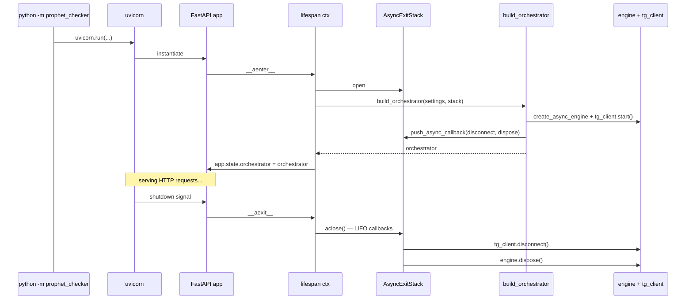

# FastAPI HTTP-Trigger — Design Spec (Task 16)

**Status:** approved 2026-05-05
**Task:** 16 (master plan) — HTTP-trigger wrapper навколо `IngestionOrchestrator.run_cycle()`
**Prerequisites:** ✅ Task 15 (IngestionOrchestrator), ✅ LLM Client Split, ✅ Task 21 (TelegramSource)
**Next:** Task 17-19 (Docker Compose, Alembic deploy, integration smoke з real Postgres + Telegram)

---

## TL;DR

Тонкий FastAPI-wrapper навколо існуючого `IngestionOrchestrator`. Один endpoint `POST /ingest/run` що sync-блокує на час циклу і повертає `CycleReport` JSON. Plus health-check.

**MVP-scope:** manual trigger через `curl` локально. Без auth, без concurrency lock, без async/job-id pattern. Все це — explicit deferred YAGNI.

Wiring через FastAPI lifespan — orchestrator + його залежності (DB engine, Telegram client) ініціалізуються один раз при старті server-а через `build_orchestrator(settings, stack)` factory. Cleanup гарантовано через `AsyncExitStack` LIFO callbacks.

---

## Architectural Decisions (Q1–Q3)

| # | Decision | Rationale |
|---|----------|-----------|
| Q1 | **Sync HTTP response — block until cycle done; return `CycleReport`** | Cron-style. Manual debugging-friendly. Async/job-id (202 Accepted + GET /jobs/:id) — additional complexity без MVP-need. |
| Q1.5 | **MVP trigger: manual `curl` локально** | Cron / AWS EventBridge / Telegram bot — пізніше. Manual single-user означає no concurrency lock + no auth. |
| Q2 | **No concurrency lock** | Manual single-user, ризик 0. `asyncio.Lock` 10 рядків коду — додамо коли scheduled trigger з'явиться. |
| Q3 | **No auth** | localhost-only deployment для MVP. Bearer token / IP allowlist — коли deploy в public network. |

---

## API surface

Тільки 2 endpoints:

| Endpoint | Method | Behavior |
|----------|--------|----------|
| `POST /ingest/run` | POST | Sync trigger. Викликає `orchestrator.run_cycle()`. Returns `CycleReport` JSON. |
| `GET /health` | GET | Returns `{"status": "ok"}`. Завжди 200 поки FastAPI live. |

### Response shapes

```json
// POST /ingest/run → 200
{
  "started_at": "2026-05-05T10:00:00Z",
  "finished_at": "2026-05-05T10:00:43Z",
  "channels_processed": [
    {
      "person_source_id": "ps1",
      "posts_seen": 7,
      "posts_with_predictions": 3,
      "predictions_extracted": 5,
      "cursor_advanced_to": "2026-05-05T09:55:00Z",
      "error": null
    }
  ]
}

// GET /health → 200
{"status": "ok"}

// POST /ingest/run → 503 (rare — startup/shutdown window)
{"detail": "orchestrator not initialized — server is starting up or shutting down"}

// POST /ingest/run → 500 (rare — unexpected exception)
{"detail": "unexpected orchestrator failure: RuntimeError"}
```

### HTTP status code matrix

| Сценарій | Status | Body |
|----------|--------|------|
| Cycle complete, all channels OK | 200 | `CycleReport`, `channels[].error == null` |
| Cycle complete, deякі channels halt'нуло | 200 | `CycleReport`, `channels[].error != null` для halted |
| `app.state.orchestrator` ще не set / shutdown | 503 | `{"detail": "..."}` |
| Catastrophic exception в orchestrator | 500 | `{"detail": "..."}` (no traceback exposed) |
| Validation error (зараз body пустий — N/A) | 422 | auto FastAPI |

**Принцип:** per-channel halts — НЕ HTTP error. Це частина CycleReport JSON. HTTP error тільки коли FastAPI app сам не може дати orchestrator або catastrophic failure.

---

## File layout

```
src/prophet_checker/
  app.py           ← NEW: FastAPI app + lifespan + endpoint handlers (~80 рядків)
  factory.py       ← NEW: build_orchestrator(settings, stack) wiring (~50 рядків)
  __main__.py      ← NEW: uvicorn entry point (~5 рядків)
  config.py        ← MODIFIED: додаємо openai_api_key + tg_session_path
```

Three flat files. Не `app/` package — для 2-3 файлів package overkill.

### Module responsibilities

| Файл | Що робить |
|------|----------|
| `factory.py` | `build_orchestrator(settings, stack) -> IngestionOrchestrator` — wiring без HTTP. Ізольовано testable. |
| `app.py` | FastAPI app, lifespan, endpoint handlers. Тонкий wrapper. |
| `__main__.py` | `uvicorn.run("prophet_checker.app:app", ...)`. Trivial entry point. |
| `config.py` | (existing) Settings — додаємо 2 fields для commit Task 16. |

---

## Wiring tree (factory.py)

```python
from contextlib import AsyncExitStack
from sqlalchemy.ext.asyncio import async_sessionmaker, create_async_engine
from telethon import TelegramClient

from prophet_checker.config import Settings
from prophet_checker.ingestion import IngestionOrchestrator
from prophet_checker.llm import LLMClient, EmbeddingClient
from prophet_checker.analysis.extractor import PredictionExtractor
from prophet_checker.models.domain import SourceType
from prophet_checker.sources.telegram import TelegramSource
from prophet_checker.storage.postgres import (
    PostgresSourceRepository,
    PostgresPredictionRepository,
)


async def build_orchestrator(
    settings: Settings, stack: AsyncExitStack
) -> IngestionOrchestrator:
    engine = create_async_engine(settings.database_url, echo=False)
    stack.push_async_callback(engine.dispose)
    session_factory = async_sessionmaker(engine, expire_on_commit=False)

    source_repo = PostgresSourceRepository(session_factory)
    prediction_repo = PostgresPredictionRepository(session_factory)

    llm = LLMClient(
        provider=settings.llm_provider,
        model=settings.llm_model,
        api_key=settings.llm_api_key,
    )
    embedder = EmbeddingClient(
        model=settings.embedding_model,
        api_key=settings.openai_api_key,
    )
    extractor = PredictionExtractor(llm)

    tg_client = TelegramClient(
        session=settings.tg_session_path,
        api_id=settings.telegram_api_id,
        api_hash=settings.telegram_api_hash,
    )
    await tg_client.start()
    stack.push_async_callback(tg_client.disconnect)
    telegram_source = TelegramSource(tg_client)

    return IngestionOrchestrator(
        session_factory=session_factory,
        source_repo=source_repo,
        prediction_repo=prediction_repo,
        extractor=extractor,
        embedder=embedder,
        sources={SourceType.TELEGRAM: telegram_source},
    )
```

**Pattern:** factory приймає `stack: AsyncExitStack` як аргумент. Власник stack — lifespan у `app.py`. Factory **реєструє** cleanup, lifespan **володіє** циклом життя.

---

## FastAPI app + lifespan (app.py)

```python
from contextlib import AsyncExitStack, asynccontextmanager
import logging

from fastapi import FastAPI, HTTPException, Request

from prophet_checker.config import Settings
from prophet_checker.factory import build_orchestrator
from prophet_checker.ingestion import CycleReport

logger = logging.getLogger(__name__)


@asynccontextmanager
async def lifespan(app: FastAPI):
    settings = Settings()
    async with AsyncExitStack() as stack:
        orchestrator = await build_orchestrator(settings, stack)
        app.state.orchestrator = orchestrator
        yield


app = FastAPI(title="prediction-tracker", lifespan=lifespan)


@app.get("/health")
async def health() -> dict[str, str]:
    return {"status": "ok"}


@app.post("/ingest/run", response_model=CycleReport)
async def run_ingestion(request: Request) -> CycleReport:
    orchestrator = getattr(request.app.state, "orchestrator", None)
    if orchestrator is None:
        raise HTTPException(
            status_code=503,
            detail="orchestrator not initialized — server is starting up or shutting down",
        )
    try:
        return await orchestrator.run_cycle()
    except Exception as exc:
        logger.exception("run_cycle failed catastrophically")
        raise HTTPException(
            status_code=500,
            detail=f"unexpected orchestrator failure: {type(exc).__name__}",
        )
```

---

## Entry point (__main__.py)

```python
import uvicorn

if __name__ == "__main__":
    uvicorn.run(
        "prophet_checker.app:app",
        host="127.0.0.1",
        port=8000,
        log_level="info",
    )
```

Запуск: `python -m prophet_checker`.

---

## Settings updates

`src/prophet_checker/config.py` потребує 2 нових fields:

```python
class Settings(BaseSettings):
    # existing fields...
    openai_api_key: str
    tg_session_path: str = "tg_session"
```

**`openai_api_key`** — окремий від `llm_api_key`. Per LLM Client Split decision: extraction може йти на Gemini (Flash Lite winner Task 13.5), але embeddings потребують OpenAI text-embedding-3-small. Single api_key більше не підходить.

**`tg_session_path`** — path до Telethon `.session` file. Default `"tg_session"` — relative до working directory (current behavior за Task 21). Має сенс для container deploy override через env var.

`.env.example` оновлюємо synchronously.

---

## Lifespan flow



---

## Error Handling

### Endpoint-level

```python
@app.post("/ingest/run", response_model=CycleReport)
async def run_ingestion(request: Request) -> CycleReport:
    orchestrator = getattr(request.app.state, "orchestrator", None)
    if orchestrator is None:
        raise HTTPException(503, "orchestrator not initialized — server is starting up or shutting down")
    try:
        return await orchestrator.run_cycle()
    except Exception as exc:
        logger.exception("run_cycle failed catastrophically")
        raise HTTPException(500, f"unexpected orchestrator failure: {type(exc).__name__}")
```

**Принцип:** orchestrator (Task 15) ВЖЕ обробляє per-channel errors внутрішньо — повертає `CycleReport` з `ChannelReport.error` field. HTTP layer додає **defensive wrapping** для catastrophic failures.

### Logging

Стандартний Python `logging`. Формат той самий що в orchestrator/repos.

**Що логуємо явно:**
- Catastrophic exception в endpoint (`logger.exception`)
- Lifespan startup success/failure (через factory's standard pattern)
- Решта — orchestrator робить сам у Task 15

**Що НЕ логуємо явно:** access logs (uvicorn вже робить), normal endpoint hits (overkill для MVP).

---

## Testing strategy

### Layer 1: Endpoint tests (`tests/test_app_endpoints.py`) — 5 tests

`httpx.AsyncClient` + `ASGITransport(app=app)` + mocked orchestrator на `app.state`.

| Test | Сценарій |
|------|----------|
| `test_health_returns_ok` | GET /health → 200 + `{"status": "ok"}` |
| `test_ingest_run_returns_cycle_report` | POST /ingest/run з mocked orchestrator → 200 + JSON CycleReport |
| `test_ingest_run_503_when_orchestrator_not_initialized` | app.state без orchestrator → 503 |
| `test_ingest_run_500_on_catastrophic_exception` | orchestrator.run_cycle raises → 500 з sanitized detail |
| `test_ingest_run_returns_per_channel_errors_as_200` | CycleReport з halted channel → 200 (не error) |

### Layer 2: Factory tests (`tests/test_factory.py`) — 2 tests

Стуббимо TelegramClient (network не тригериться в unit-test), перевіряємо wiring + cleanup registration.

| Test | Сценарій |
|------|----------|
| `test_build_orchestrator_returns_orchestrator` | Settings + stack → IngestionOrchestrator instance |
| `test_build_orchestrator_registers_cleanup` | Після `stack.aclose()` — `tg.disconnect()` called once |

### Layer 3: Settings test (`tests/test_config.py`) — 1 test

| Test | Сценарій |
|------|----------|
| `test_settings_includes_new_fastapi_fields` | Settings має `openai_api_key` + `tg_session_path` + правильний default |

### Test count delta

- +5 endpoint
- +2 factory
- +1 config
- = **+8 tests**

Поточних 114 + 8 = **122** після Task 16.

### Чого НЕ тестуємо в Task 16

- ❌ Real lifespan з real factory (потребує real Postgres + Telegram session — Task 19)
- ❌ Real `python -m prophet_checker` startup (manual smoke sufficient)
- ❌ Concurrent requests (no lock — defer)
- ❌ Auth (no auth)
- ❌ Performance / load — moot until production traffic

---

## Out of Scope (explicitly deferred)

- ❌ **Auth** (Bearer token, IP allowlist) — деплой в public network ще не відбувся
- ❌ **Concurrency protection** (`asyncio.Lock` або Postgres advisory lock) — manual MVP
- ❌ **Async / job-id pattern** (202 Accepted + `GET /jobs/:id`) — sync sufficient для cron-style
- ❌ **Multi-replica deployment** — single-instance MVP
- ❌ **OpenAPI / Swagger UI customization** — FastAPI default достатньо
- ❌ **Request validation / params** — endpoint-body порожній
- ❌ **Admin endpoints** (force-cursor-reset, list-stuck-channels) — manual SQL works для MVP
- ❌ **Metrics / observability** (Prometheus, OpenTelemetry) — log-based monitoring sufficient
- ❌ **Real integration smoke з Postgres + Telegram** — Task 19

---

## Cross-references

- **Task 15 IngestionOrchestrator** (prerequisite): [`2026-05-01-ingestion-orchestrator-design.md`](2026-05-01-ingestion-orchestrator-design.md)
- **Task 15 sequence diagrams:** [`2026-05-01-ingestion-orchestrator-sequence.md`](2026-05-01-ingestion-orchestrator-sequence.md)
- **LLM Client Split** (justifies separate openai_api_key): [`2026-05-01-llm-client-split-design.md`](2026-05-01-llm-client-split-design.md)
- **Architecture overview:** [`../architecture/2026-04-26-architecture-current.md`](../architecture/2026-04-26-architecture-current.md)
- **Master plan:** [`../plan/2026-04-08-prophet-checker-plan.md`](../plan/2026-04-08-prophet-checker-plan.md)
