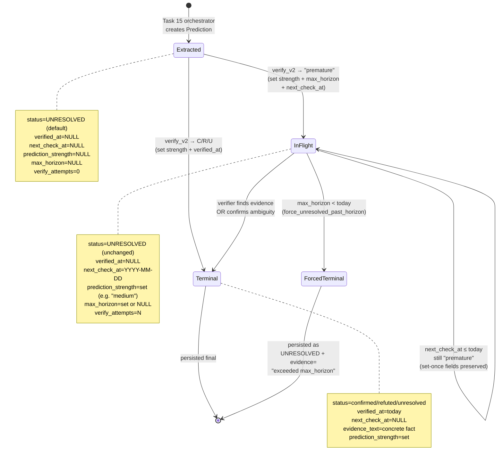

# Prediction Lifecycle — State Machine

**Дата:** 2026-04-29
**Status:** Reference
**Spec:** [`2026-04-26-verification-trigger-policy-design.md`](2026-04-26-verification-trigger-policy-design.md)

Стани, через які проходить ОДНА `Prediction` від моменту створення (extraction) до terminal verdict. Цикл може містити кілька викликів verifier'а — між ними prediction "спить" у БД до настання `next_check_at`.

---

## Cost-per-prediction (envelope estimate)

- **Cheap path:** 1 verify call → terminal. Cost ≈ 1 × Opus call.
- **Worst case:** ~10 verifies (vague open-ended) → terminal або timeout. Cost ≈ 10 × Opus calls.
- **Бюджетна оцінка:** 1000 predictions × avg 2.5 verifies = 2500 Opus calls × ~3k tokens × ($5 / 1M input + $25 / 1M output) ≈ **$40 на 1000 predictions** на Opus 4.6.

## Чому `PREMATURE` НЕ persisted у `status`

`InFlight` стан описується **комбінацією** полів: `status=UNRESOLVED AND verified_at=NULL AND next_check_at IS NOT NULL`. Окремий enum-value `PREMATURE` не потрібен — він би дублював інформацію в `next_check_at`. Це дозволяє єдиний trigger filter для черги (`get_eligible_for_verification`, див. [verification-cycle doc](2026-04-29-verification-cycle.md)).

---

## Cross-references

- Single verify_v2 call (один перехід state machine): [`2026-04-29-verifier-v2-call.md`](2026-04-29-verifier-v2-call.md)
- Full orchestration cycle (включно з SQL-фільтром eligible): [`2026-04-29-verification-cycle.md`](2026-04-29-verification-cycle.md)
- Spec: [`2026-04-26-verification-trigger-policy-design.md`](2026-04-26-verification-trigger-policy-design.md)
