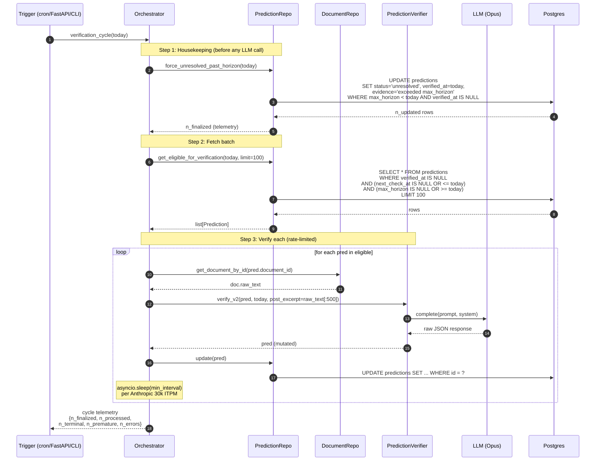

# Verification Cycle — Orchestrator Data Flow

**Дата:** 2026-04-29
**Status:** Reference (Task 15 буде це викликати)
**Spec:** [`2026-04-26-verification-trigger-policy-design.md`](2026-04-26-verification-trigger-policy-design.md)

Один запуск scheduler-cycle: housekeeping → fetch batch → verify each. Це pseudo-orchestrator — реальний `verification_cycle()` буде написаний у Task 15.

---

## Чому Step 1 ВПЕРЕД, не паралельно з Step 2

Якщо запустити одночасно — Step 2 може потягнути prediction з `max_horizon < today`, відправити його на Opus, отримати очікуване `unresolved`, і витратити LLM call даремно. Step 1 відсікає expired-horizon **до** будь-яких LLM-викликів.

Інша причина: Step 1 — це bulk SQL `UPDATE`, дешева операція. Step 3 — N × LLM-calls, дорого. Cleanup перед навантаженням → менше шансів зустріти "сміття" в фазі N×3.

## Telemetry

Cycle повертає 5 лічильників:

| Field | Meaning | Сигнал якщо аномально |
|-------|---------|----------------------|
| `n_finalized` | predictions закриті housekeeping'ом (max_horizon expired) | Якщо великий — verifier не справляється з premature за свій horizon |
| `n_processed` | predictions через verifier цього cycle | Telemetry на cycle throughput |
| `n_terminal` | з n_processed: ті що отримали final verdict | Higher = better |
| `n_premature` | з n_processed: ті що повернулись у чергу з `next_check_at` | Higher = vague predictions переважають |
| `n_errors` | LLM/parse-failures (`verify_attempts++` only) | Будь-яка ненульова цифра — alert |

---

## Cross-references

- Single verify_v2 call (Step 3 деталі): [`2026-04-29-verifier-v2-call.md`](2026-04-29-verifier-v2-call.md)
- Як cycle переводить prediction між станами: [`2026-04-29-prediction-lifecycle.md`](2026-04-29-prediction-lifecycle.md)
- Spec: [`2026-04-26-verification-trigger-policy-design.md`](2026-04-26-verification-trigger-policy-design.md)
- Implementation plan: [`2026-04-29-verification-trigger-policy-plan.md`](2026-04-29-verification-trigger-policy-plan.md)
