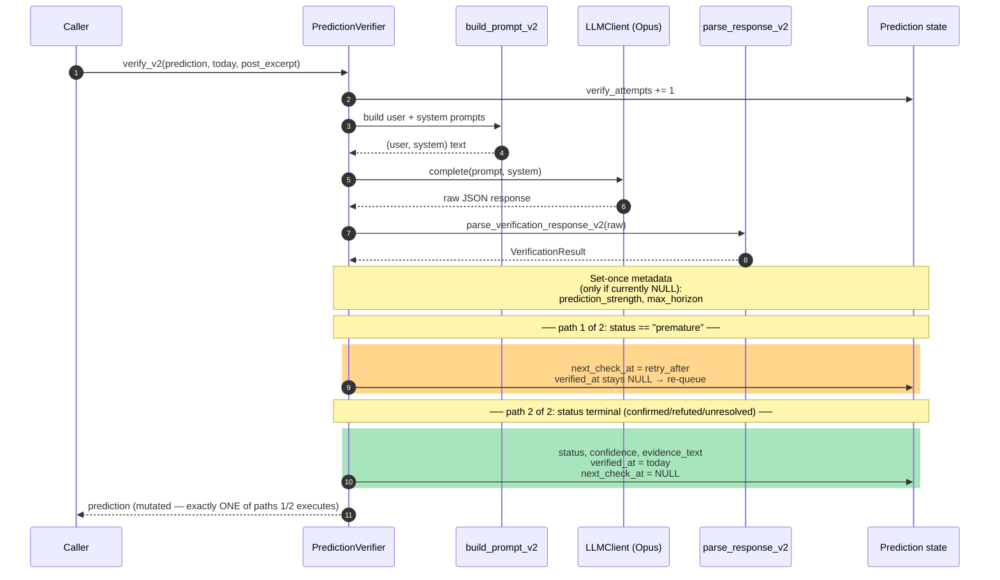
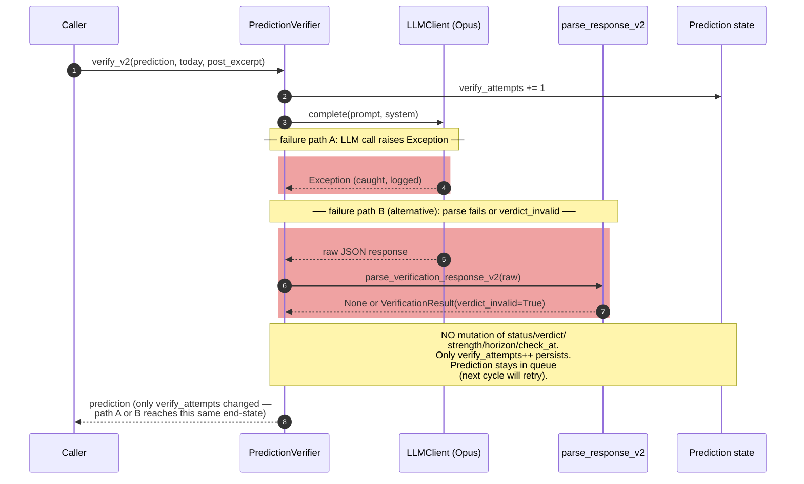

# Verifier v2 — Single Call Data Flow

**Дата:** 2026-04-29
**Status:** Reference
**Spec:** [`2026-04-26-verification-trigger-policy-design.md`](2026-04-26-verification-trigger-policy-design.md)

Що відбувається у момент виклику `verifier.verify_v2(prediction, today, post_excerpt)` на ОДНУ prediction. Дві діаграми: happy path + failure modes (вони симетричні — навмисно).

---

## 1a. Happy path (LLM ok, parse ok)

Лінійний flow без branching: caller → verifier → prompt → LLM → parser → mutation → return. Єдиний `alt` у кінці — terminal vs premature (це ключове рішення verifier'а).

## 1b. Failure modes — symmetric early-return

При LLM-exception або parse-failure verifier поводиться однаково — це навмисна симетрія. Тільки `verify_attempts++` персиститься; решта state не торкається. Prediction лишається в queue, наступний cycle спробує знову.

## Інваріанти

- `verify_attempts` ВЖЕ ЗБІЛЬШЕНО, навіть якщо все інше провалилось (Diagram 1b).
- `prediction_strength` і `max_horizon` встановлюються **раз** (set-once); подальші виклики не переписують.
- `next_check_at` і `verified_at` — взаємно виключаючі: in-flight prediction має `next_check_at != NULL AND verified_at = NULL`; terminal — навпаки.

---

## Cross-references

- Lifecycle ОДНІЄЇ prediction через серію `verify_v2()` дзвінків: [`2026-04-29-prediction-lifecycle.md`](2026-04-29-prediction-lifecycle.md)
- Як verifier викликається з orchestrator'а: [`2026-04-29-verification-cycle.md`](2026-04-29-verification-cycle.md)
- Spec: [`2026-04-26-verification-trigger-policy-design.md`](2026-04-26-verification-trigger-policy-design.md)
- Implementation plan: [`2026-04-29-verification-trigger-policy-plan.md`](2026-04-29-verification-trigger-policy-plan.md)
