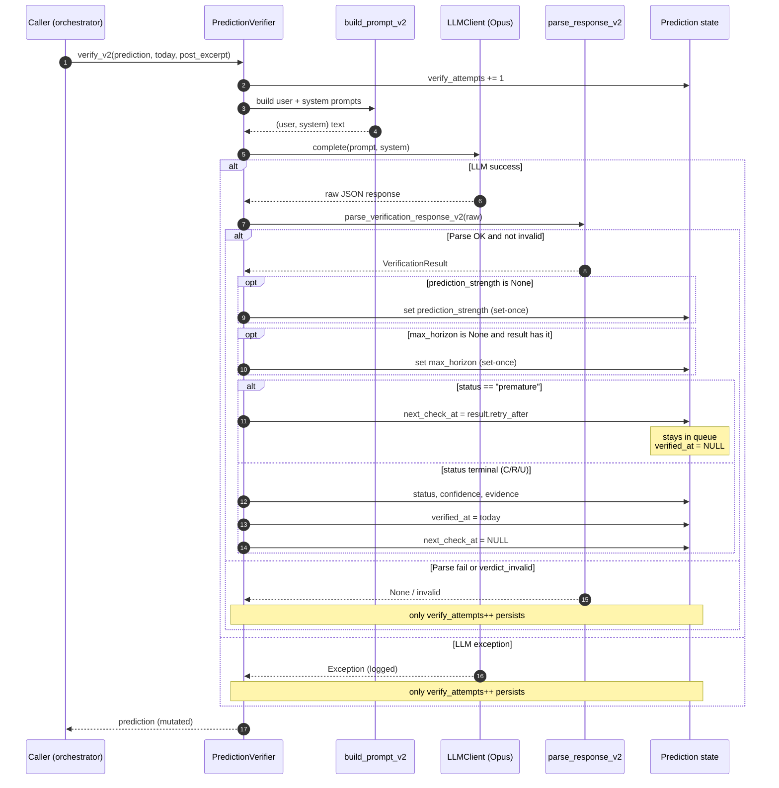
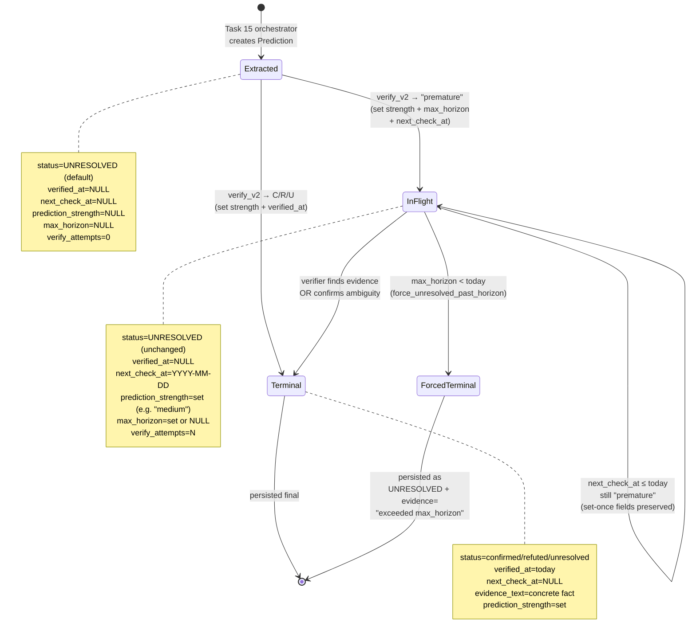
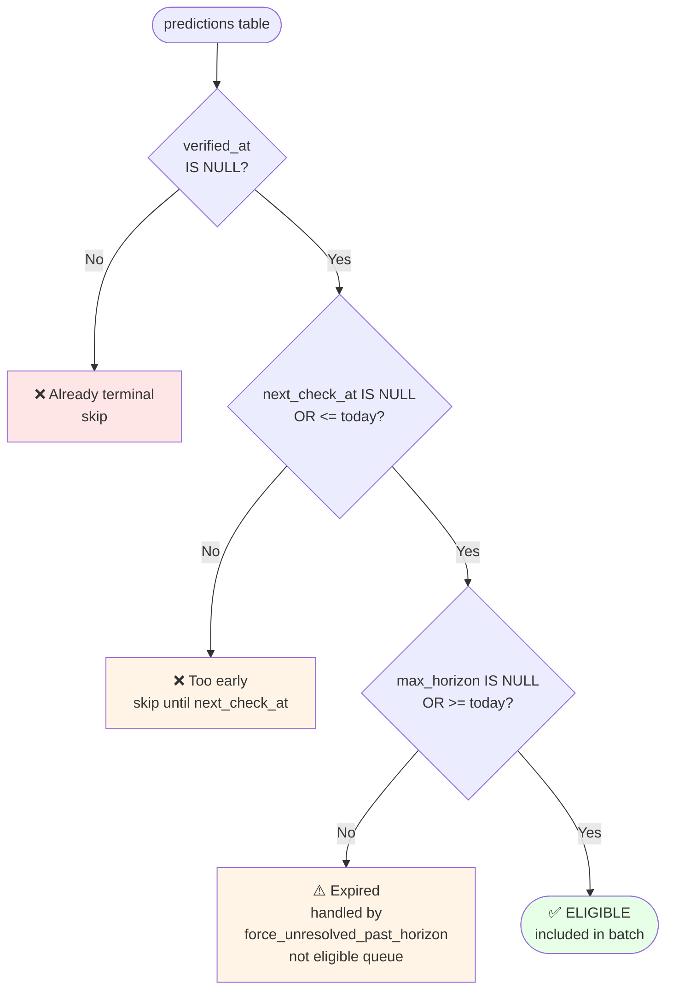
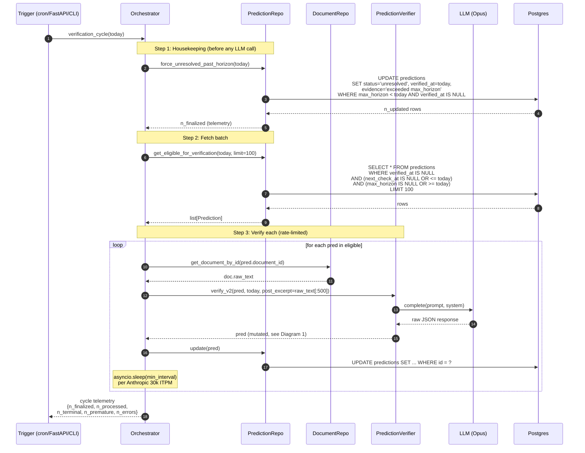
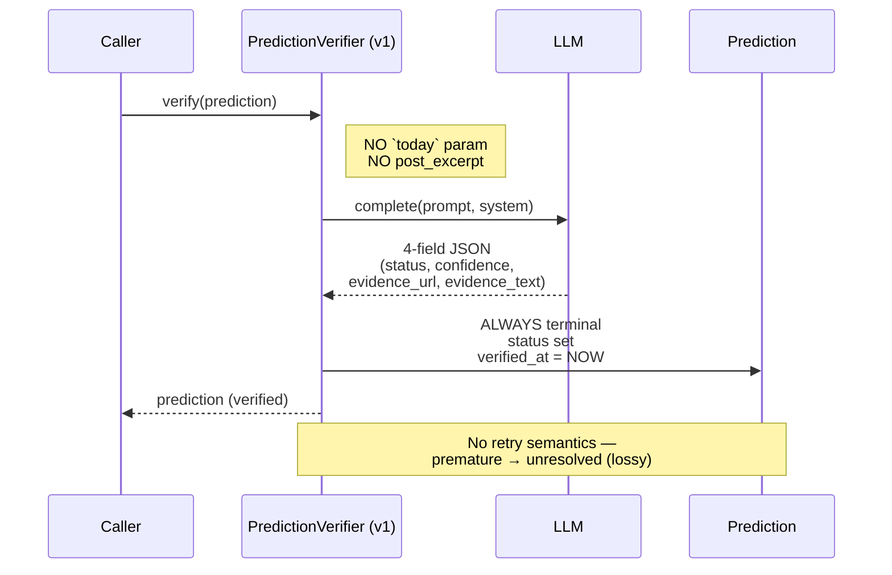
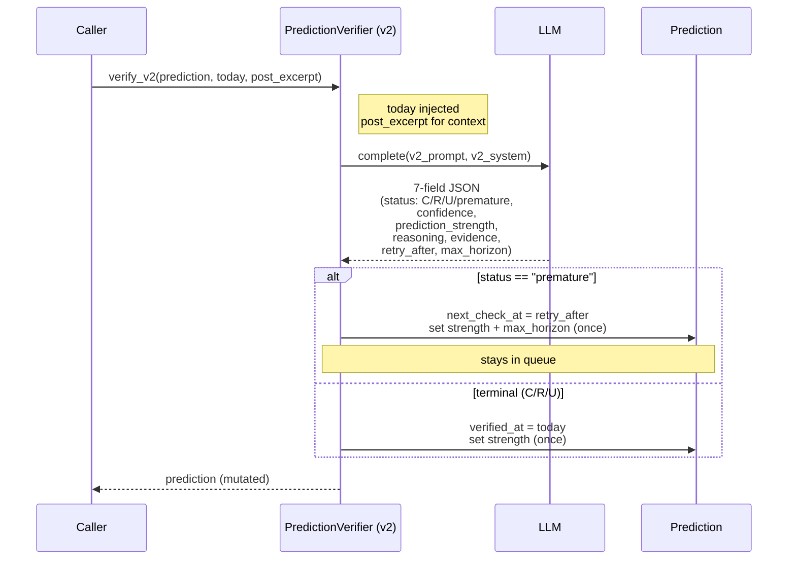

# Verifier v2 — Data Flow Diagrams

**Дата:** 2026-04-29
**Доповнює:** [`2026-04-26-verification-trigger-policy-design.md`](2026-04-26-verification-trigger-policy-design.md) (the spec)
**Статус:** Reference visualization — for understanding, not implementation gate

5 візуалізацій Verifier v2 у форматі Mermaid (рендериться у GitHub, GitLab, Obsidian out-of-the-box). Спершу читай spec для контексту; ці діаграми — для швидкого огляду «як воно тече».

---

## 1. Single verification call — `verify_v2(prediction, today, post_excerpt)`

Що відбувається у момент виклику verifier'а на ОДНУ prediction.

**Інваріанти, які тримаються:**

- `verify_attempts` ВЖЕ ЗБІЛЬШЕНО, навіть якщо все інше провалилось.
- `prediction_strength` і `max_horizon` встановлюються **раз** (set-once); подальші виклики їх не переписують.
- `next_check_at` і `verified_at` — взаємно виключаючі: in-flight prediction має `next_check_at != NULL AND verified_at = NULL`; terminal — навпаки.

---

## 2. Lifecycle of a Prediction — multiple verifications over time

Стани, через які проходить ОДНА prediction від моменту створення (extraction) до terminal verdict.

**Cost-per-prediction (envelope estimate):**

- Cheap path: 1 verify call → terminal. Cost ≈ 1 × Opus call.
- Worst case: ~10 verifies (vague open-ended) → terminal або timeout. Cost ≈ 10 × Opus calls.
- Бюджетна оцінка: 1000 predictions × avg 2.5 verifies = 2500 Opus calls × ~3k tokens × ($5 / 1M input + $25 / 1M output) ≈ $40 на 1000 predictions on Opus.

---

## 3. Trigger logic — `get_eligible_for_verification(today, limit)`

Який саме фільтр SQL застосовується кожний cycle.

**Приклад того як фільтр застосовується до 5 різних predictions** (today = 2026-04-29):

| id | status | verified_at | next_check_at | max_horizon | Verdict |
|----|--------|-------------|---------------|-------------|---------|
| p1 | UNRES | NULL | NULL | NULL | ✅ eligible (fresh extracted) |
| p2 | UNRES | NULL | 2027-01-01 | NULL | ❌ next_check_at > today |
| p3 | UNRES | NULL | 2026-04-01 | NULL | ✅ eligible (next_check_at passed) |
| p4 | CONFIRM | 2025-08-15 | NULL | NULL | ❌ already terminal |
| p5 | UNRES | NULL | NULL | 2025-12-31 | ⚠️ horizon exceeded — handled by housekeeping |

**Index used:** `idx_predictions_eligible(verified_at, next_check_at, max_horizon)`. Composite index ensures O(log N) filter навіть при мільйоні rows.

---

## 4. Full verification cycle — orchestrator combining everything

Один запуск scheduler-cycle (Task 15 буде це викликати).

**Чому Step 1 ВПЕРЕД, не паралельно з Step 2:**
Якщо запустити одночасно — Step 2 може потягнути prediction з `max_horizon < today`, відправити його на Opus, отримати очікуване `unresolved`, і витратити LLM call даремно. Step 1 відсікає expired-horizon **до** будь-яких LLM-викликів.

---

## 5. v1 vs v2 — what changed

### Old verifier (v1) — single-shot, 4-field output

### New verifier (v2) — supports retry-loop, 7-field output

### Що додалось у v2

| Feature | Чим розв'язує |
|---------|--------------|
| `premature` status | "wait, can't verify yet" — вирішує бідні `unresolved` для майбутніх подій |
| `prediction_strength` | track-record статистика — розрізняти high-quality від vague hedges |
| `max_horizon` | finite check window — не перевіряти "Зеленський втратить владу" 50 років |
| `retry_after` | дешевий retry-loop через `next_check_at` поле |
| `today` injection | LLM знає референс-дату, правильно judges retry/horizon |
| `post_excerpt` | для conditional ("якщо X") дає контекст коли X сталось |
| Mutual-exclusion in parser | відсікає Opus inconsistency (unresolved + retry_after) |

---

## Cross-references

- Spec: [`2026-04-26-verification-trigger-policy-design.md`](2026-04-26-verification-trigger-policy-design.md)
- Implementation plan: [`2026-04-29-verification-trigger-policy-plan.md`](2026-04-29-verification-trigger-policy-plan.md)
- Architecture refresh (where Flow 5b lives): [`../architecture/2026-04-26-architecture-current.md`](../architecture/2026-04-26-architecture-current.md)
- v1 empirical baseline: `scripts/outputs/extraction_eval/verifier_4status_test.json`
